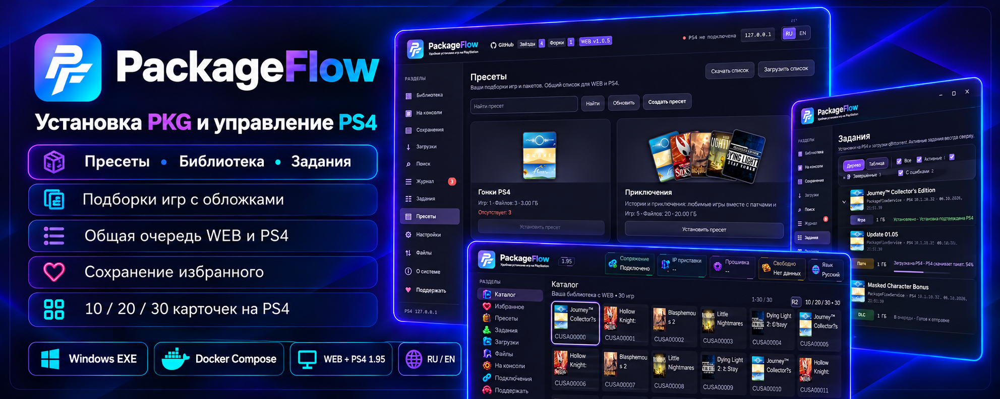
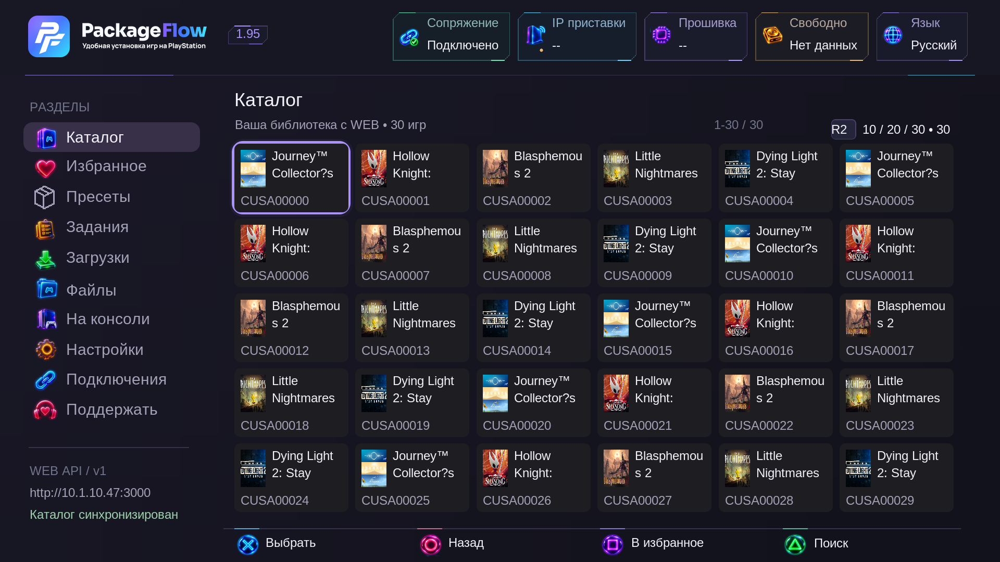
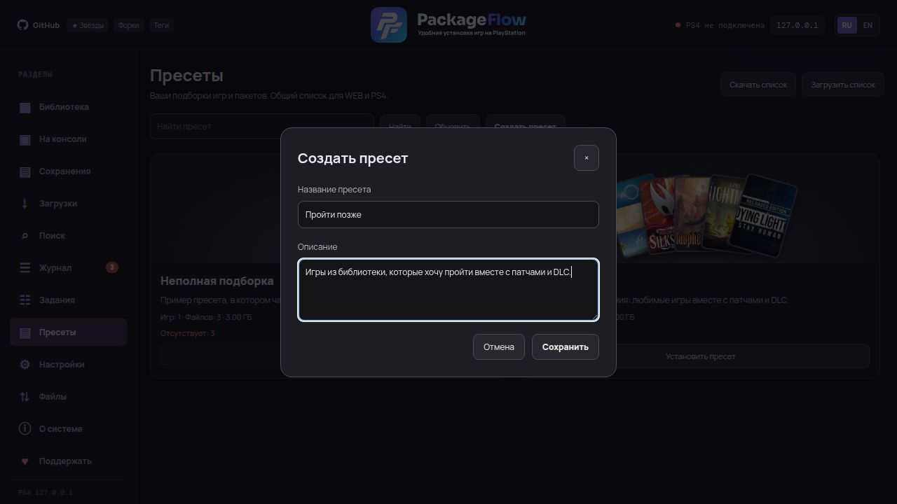
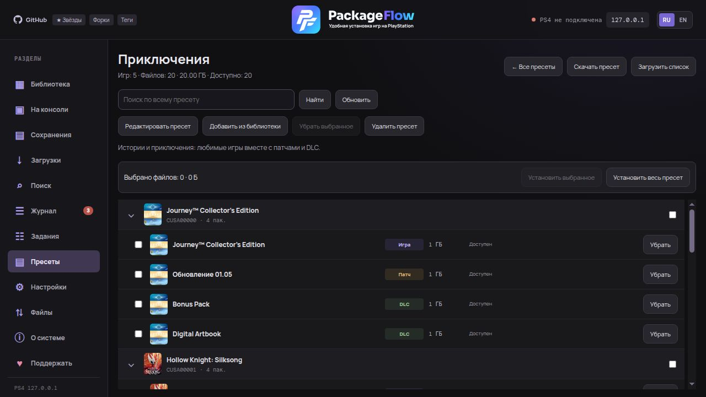
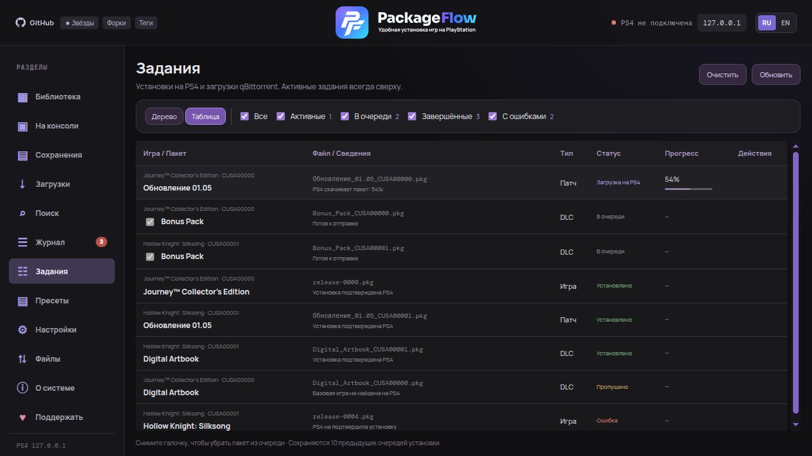
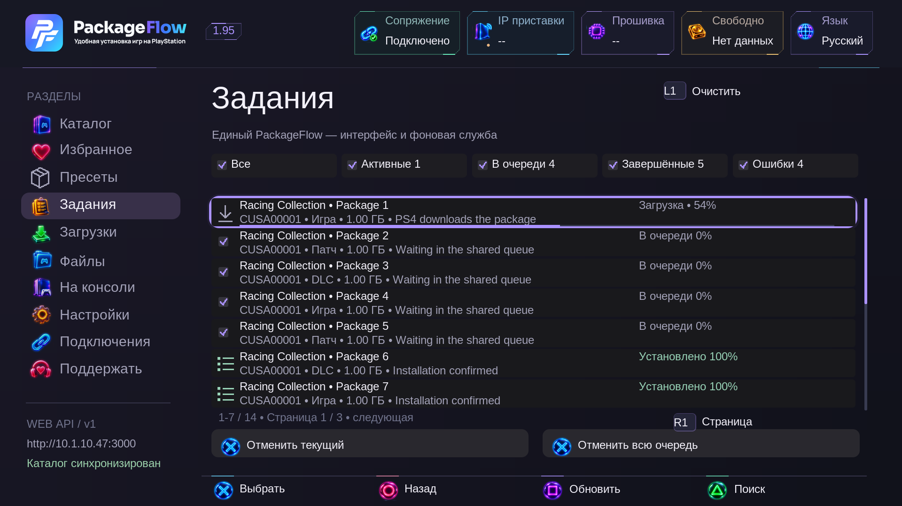
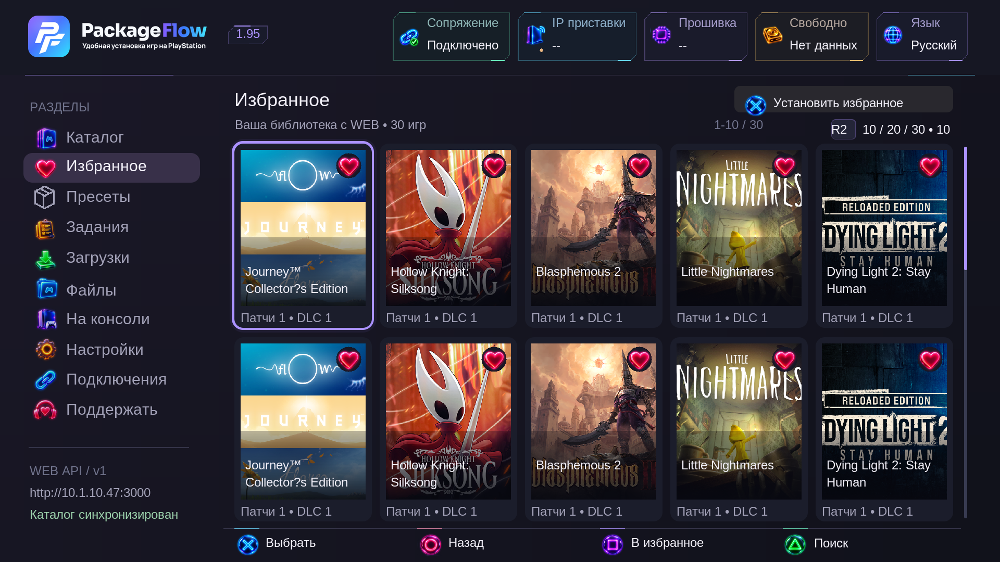

# PackageFlow

**Установка PKG на PlayStation 4 по сети и управление консолью.** WEB на ПК/NAS и приложение PackageFlowService на PS4 используют общую библиотеку и очередь. Пакеты передаются напрямую из вашей папки по HTTP, без USB и промежуточного копирования. Для Windows доступен **установщик EXE с мастером настройки и управления**.

[Релизы и PKG](https://github.com/demagoc3-cpu/playstation_installer/releases) · [Документация RU](docs/ru/index.md) · [Documentation EN](docs/en/index.md) · [Тема 4PDA](https://4pda.to/forum/index.php?showtopic=1127073)

## Возможности

- **Библиотека:** обложки, группировка игры, патчей и DLC, страницы по 25/50/100 карточек игр с внутренней прокруткой, поиск по всей библиотеке, установка выбранного или всего комплекта, переустановка.
- **[Пресеты](docs/ru/presets.md):** подборки с названием, описанием и обложками, количеством файлов и размером. Установка всего пресета или выбранных пакетов из WEB и PS4, редактирование, экспорт и импорт списка.
- **Общие задания WEB / PS4:** дерево игр с патчами и DLC или таблица, прогресс, фильтры, отмена отдельного пакета и очистка завершённых записей и ошибок. Основной способ — PackageFlowService, резервный — PyLoader.
- **Приложение PS4:** Full HD, геймпад, штатная клавиатура, сопряжение, автообновление и настройки службы. Сохранение избранного, установка всего избранного, каталог по 10/20/30 карточек и страницы истории заданий.
- **Файлы и консоль:** файловый менеджер, локальные PKG, установленные приложения, сохранения и сведения о системе.
- **Поиск и загрузки:** Prowlarr/Jackett, карточки с описанием и обложкой, qBittorrent и автоустановка.
- **Мастер Windows:** автоматическая подготовка WEB, Prowlarr, FlareSolverr и qBittorrent; поиск PS4 в сети, первоначальная установка сервиса через PyLoader и сопряжение. Выбор и индексация папки PKG, статусы подключений, журнал, автозапуск и обновление из GitHub.
- **RU / EN:** переключение языка с сохранением выбора.

## Быстрый запуск

Нужна **PS4 с активным GoldHEN** и компьютер в той же локальной сети. WEB работает на Windows, Linux и macOS.

### Windows — установщик

1. Скачайте **`PackageFlowSetup-…-x64.exe`** из [Releases](https://github.com/demagoc3-cpu/playstation_installer/releases) и установите на **Windows 10/11 x64**. WEB, Node.js и среда .NET уже входят в комплект. В конце установки можно добавить ярлык на рабочий стол.
2. При первом запуске мастер сам подготовит WEB, Prowlarr, FlareSolverr и qBittorrent. Ход настройки виден внизу окна. При установке qBittorrent подтвердите запрос администратора Windows.
3. На шаге **«PS4»** нажмите **«Найти PS4»** или введите IP. Если сервиса ещё нет, включите **GoldHEN и PyLoader (порт 9090)** на приставке и нажмите **«Установить сервис»**. Дождитесь установки PKG на PS4, запустите PackageFlow, получите код в **«Подключениях»**, введите его в мастере и нажмите **«Сопряжение»** в мастере. PKG также можно установить вручную из Releases.
4. На шаге **«Поиск»** введите логин и пароль RuTracker и нажмите **«Добавить RuTracker и проверить»**. Если трекер просит капчу, используйте **«Войти вручную»** — окно браузера дождётся подтверждения входа. Откройте WEB и устанавливайте игры; свою папку PKG выберите на шаге **«Установка»** → **«Применить»**.

Мастер показывает состояние всех подключений. Прерванную подготовку можно повторить кнопкой **«Подготовить компоненты»**. Уже настроенное подключение qBittorrent сохраняется; для нового создаётся отдельный профиль PackageFlow. Поиск и сопряжение можно настроить позже.

Также доступен режим **Docker Compose** — для него нужны установленный и запущенный Docker Desktop. Подробности: [руководство Windows](docs/ru/windows.md).

### Linux, macOS и запуск из исходников

[Docker для Linux и NAS](docs/ru/docker.md) позволяет запускать готовый образ.

Для запуска из исходников установите **Node.js 22 LTS и pnpm**, затем:

```sh
git clone https://github.com/demagoc3-cpu/playstation_installer.git
cd playstation_installer
pnpm install
pnpm build
pnpm start
```

1. Откройте WEB: `http://localhost:3000`. Установите и запустите PKG PackageFlow на PS4 из [Releases](https://github.com/demagoc3-cpu/playstation_installer/releases).
2. В WEB откройте **«Настройки»**, укажите IP приставки и выберите способ установки. В приложении PS4 откройте **«Подключения»** и введите полученный код в WEB. [Настройка адреса WEB и сопряжения](docs/ru/ps4-app.md).
3. Добавьте папку PKG в **«Библиотеку»** и запускайте установки из браузера или приложения PS4.

ПК/NAS должен оставаться включённым при установке из его библиотеки. Торренты скачивает qBittorrent на ПК/NAS, установкой управляет сервис. PS5 не поддерживается.

Для пресетов, сохранения избранного и новых кнопок на консоли установите **PackageFlowService 1.95** вместе с обновлённым WEB. [Библиотека и задания](docs/ru/library.md) · [Пресеты и управление на PS4](docs/ru/presets.md).

## Скриншоты

WEB показан на тестовой библиотеке из **2800 пакетов**. Снимки PS4 — предпросмотр интерфейса **1.95**; они не являются отчётом о проверке на приставке. В мастер Windows входит тот же WEB.

| WEB — библиотека и полные ветки игр | WEB — карточки пресетов |
|---|---|
| [](docs/screenshots/library-current.png) | [](docs/screenshots/web-presets-cards.png) |

| WEB — задания с единым деревом и статусами | PS4 — 30 карточек каталога |
|---|---|
| [](docs/screenshots/web-tasks-tree.png) | [](docs/screenshots/ps4-catalog-30.png) |

<details>
<summary>Создание и состав пресета, таблица заданий и управление на PS4</summary>











</details>

| Мастер Windows — установка и статусы | Мастер Windows — поиск PS4 и установка сервиса |
|---|---|
| [](docs/screenshots/windows-setup.png) | [](docs/screenshots/windows-pairing.png) |

<details>
<summary>Мастер Windows — RuTracker и ручной вход при капче</summary>


</details>

<details>
<summary>Поиск — карточка раздачи с обложкой и описанием</summary>


</details>

## Документация

Подробные инструкции по всем разделам: **[Русский](docs/ru/index.md)** · **[English](docs/en/index.md)**.

[План развития](docs/ru/roadmap.md) · [API и разработка](docs/ru/development.md) · [Сообщить об ошибке](https://github.com/demagoc3-cpu/playstation_installer/issues)

## Лицензия

WEB — [MIT](LICENSE). PackageFlowService распространяется готовым PKG, его исходники приватные. Сторонний payload DirectPackageInstaller — GPL-3.0: [уведомления](THIRD_PARTY_NOTICES.md).

Проект предназначен для собственных резервных копий и homebrew, не распространяет игры и не связан с Sony.
