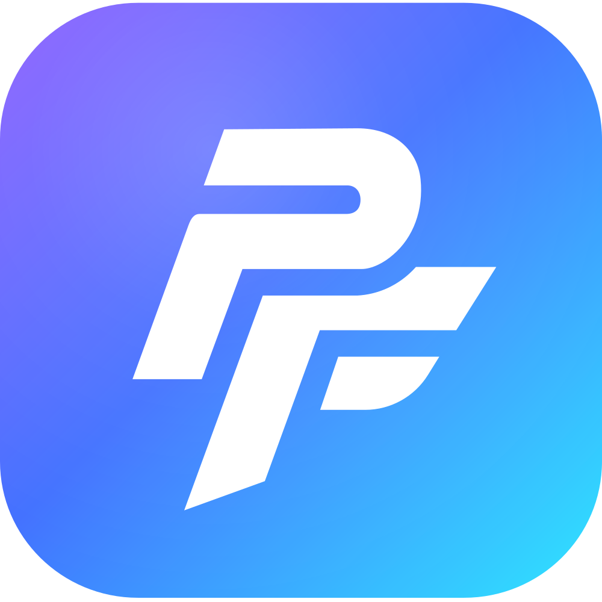
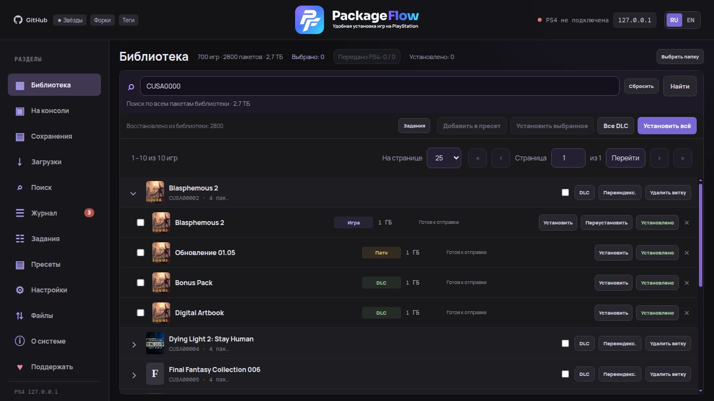
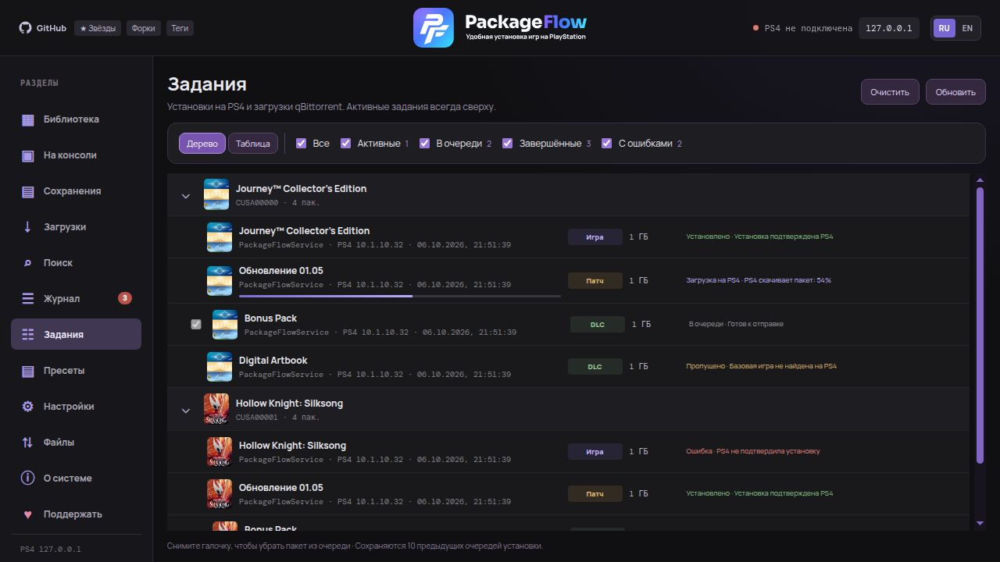
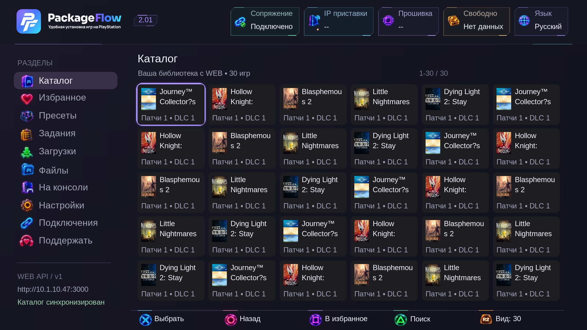
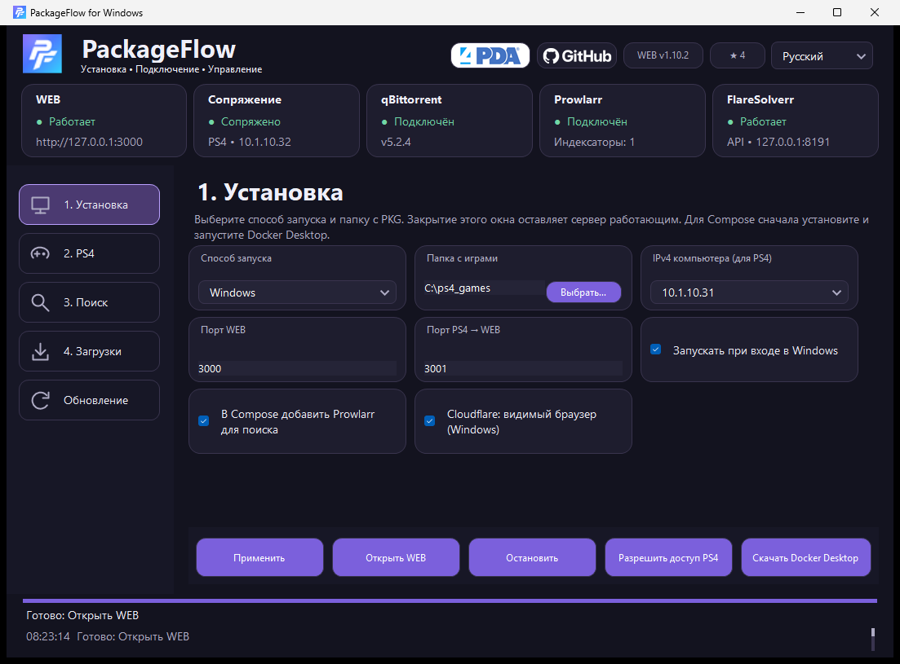
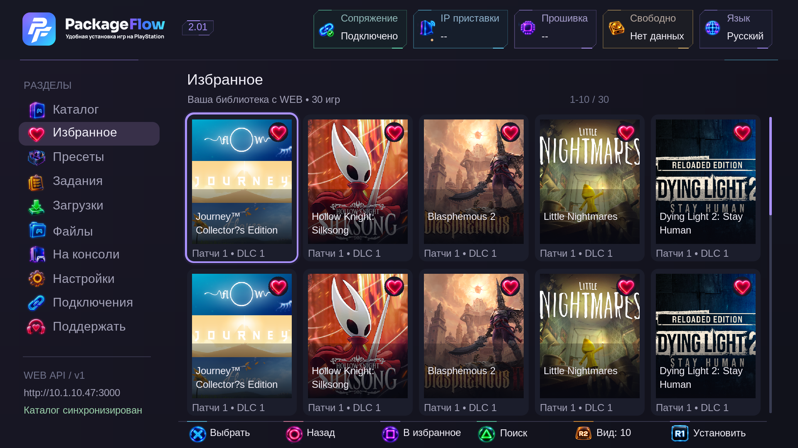
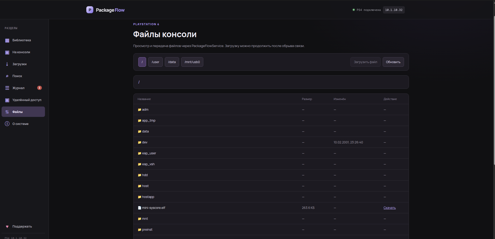

<p align="center">
  
</p>

<h1 align="center">PackageFlow</h1>

<p align="center">
  <strong>Ваша библиотека. Ваша консоль. Установка по сети.</strong><br>
  Установка PKG на PlayStation 4, управление библиотекой и заданиями<br>
  из браузера или приложения на приставке.
</p>

<p align="center">
  <a href="https://github.com/demagoc3-cpu/playstation_installer/releases/latest"></a>
  <a href="LICENSE"></a>
  <a href="#установка"></a>
  <br>
  <a href="docs/ru/ps4-app.md"></a>
  <a href="docs/README.md"></a>
  <a href="https://discord.gg/Xj6EPJyAq"></a>
</p>

<p align="center">
  <a href="https://github.com/demagoc3-cpu/playstation_installer/releases">Скачать</a> ·
  <a href="docs/ru/index.md">Документация RU</a> ·
  <a href="docs/en/index.md">Documentation EN</a> ·
  <a href="https://discord.gg/Xj6EPJyAq">Discord</a> ·
  <a href="https://4pda.to/forum/index.php?showtopic=1127073">4PDA</a>
</p>

---

## О проекте

**PackageFlow** объединяет WEB на компьютере или NAS и **PackageFlowService** на PS4. Добавьте свои PKG в библиотеку, выберите игру вместе с патчами и DLC и отправьте установку из браузера или с геймпада.

Консоль получает файлы напрямую с компьютера по HTTP. Промежуточное копирование на USB не требуется. WEB открывается в браузере на компьютере, телефоне или планшете; интерфейс приставки позволяет работать с той же библиотекой и очередью.

## Возможности

| Раздел | Что доступно |
|---|---|
| **Библиотека** | Обложки, поиск, страницы каталога, группировка игры с патчами и DLC, установка выбранных пакетов или всего комплекта. Локальные и подключённые сетевые папки. |
| **Пресеты** | Собственные подборки игр, редактирование состава, установка всей подборки, импорт и экспорт списка. |
| **Задания** | Общая очередь WEB и PS4, прогресс, дерево или таблица, фильтры, отмена пакетов и веток игры, история установок. |
| **Приложение PS4** | Управление геймпадом, штатная клавиатура, каталог и избранное, пресеты, задания, сопряжение и настройки службы. |
| **Файлы и консоль** | Файловый менеджер, локальные PKG, установленные приложения, сохранения и сведения о системе. |
| **Поиск и загрузки** | Интеграция с Prowlarr / Jackett и qBittorrent, карточки раздач и автоматическая установка после загрузки. |
| **Windows** | Установщик EXE, мастер настройки, поиск PS4 в сети, установка сервиса, сопряжение, автозапуск и обновления. |
| **Языки** | Русский и английский с сохранением выбора. |

## Как это работает

**Папки с PKG → библиотека WEB → очередь PackageFlowService → установка на PS4.**

WEB хранит каталог и отдаёт файлы, фоновая служба на PS4 управляет установкой. Основной способ подключения — PackageFlowService; для первоначальной установки сервиса и резервного подключения доступен PyLoader.

> Для работы нужна PS4 с активным **GoldHEN** и доступом к компьютеру / NAS по сети. Компьютер, на котором запущен WEB, должен оставаться включённым во время установки.

## Установка

### Windows 10 / 11 x64

1. Скачайте **`PackageFlowSetup-…-x64.exe`** из [Releases](https://github.com/demagoc3-cpu/playstation_installer/releases/latest). WEB, Node.js и среда .NET входят в комплект.
2. Запустите мастер и подготовьте компоненты. Поиск и загрузки можно настроить позже.
3. Добавьте PS4. Установите PackageFlowService через мастер с помощью GoldHEN и PyLoader или вручную из PKG релиза.
4. Запустите приложение на приставке, получите код в **«Подключениях»** и выполните сопряжение. Добавьте свои PKG и откройте WEB: **`http://localhost:3000`**.

[Подробное руководство Windows →](docs/ru/windows.md)

### Docker · Linux · NAS

Готовый Docker-образ позволяет запустить WEB на сервере или NAS. Подключите папки с PKG и сохраните каталог данных между обновлениями.

[Запуск через Docker Compose →](docs/ru/docker.md)

<details>
<summary><strong>Запуск из исходников — Linux, macOS и Windows</strong></summary>

Понадобятся **Node.js 22 LTS** и **pnpm**.

```sh
git clone https://github.com/demagoc3-cpu/playstation_installer.git
cd playstation_installer
pnpm install
pnpm build
pnpm start
```

Откройте **`http://localhost:3000`**, настройте IP приставки и сопряжение в WEB, затем добавьте папку PKG в библиотеку. Установите и запустите PackageFlowService на PS4 из [Releases](https://github.com/demagoc3-cpu/playstation_installer/releases).

[Требования, сеть и автозапуск →](docs/ru/getting-started.md)

</details>

## Интерфейс

| Библиотека WEB | Пресеты |
|---|---|
| [](docs/screenshots/library-current.png) | [](docs/screenshots/web-presets-cards.png) |

| Задания WEB | Приложение PS4 |
|---|---|
| [](docs/screenshots/web-tasks-tree.png) | [](docs/screenshots/ps4-catalog-30-2.01.png) |

<sub>Скриншоты WEB получены на тестовой библиотеке. Изображение PS4 — предпросмотр интерфейса.</sub>

<details>
<summary>Ещё скриншоты: Windows, файлы, избранное и пресеты PS4</summary>








</details>

## Документация и поддержка

| Нужна помощь с… | Руководство |
|---|---|
| Первым запуском и сетью | [Установка WEB](docs/ru/getting-started.md) · [Windows](docs/ru/windows.md) · [Docker](docs/ru/docker.md) |
| Приставкой и сопряжением | [Приложение PS4](docs/ru/ps4-app.md) |
| Библиотекой и установками | [Библиотека и задания](docs/ru/library.md) · [Пресеты](docs/ru/presets.md) |
| Поиском и загрузками | [Поиск](docs/ru/search.md) · [qBittorrent](docs/ru/torrents.md) |
| Ошибками и обновлениями | [Решение проблем](docs/ru/troubleshooting.md) · [Обновления и данные](docs/ru/updates-data.md) |
| API и разработкой | [Документация разработчика](docs/ru/development.md) |

**Общение, вопросы и обратная связь:** [Discord](https://discord.gg/Xj6EPJyAq) · [Тема на 4PDA](https://4pda.to/forum/index.php?showtopic=1127073).

Нашли ошибку? [Создайте Issue](https://github.com/demagoc3-cpu/playstation_installer/issues) и укажите версии WEB и сервиса, описание действий и текст ошибки.

[Полная документация RU](docs/ru/index.md) · [Full documentation EN](docs/en/index.md)

## Лицензия

WEB распространяется по лицензии [MIT](LICENSE). PackageFlowService доступен готовым PKG; его исходники приватные. Сторонний payload DirectPackageInstaller — GPL-3.0: [уведомления о сторонних компонентах](THIRD_PARTY_NOTICES.md).

PackageFlow предназначен для собственных резервных копий и homebrew, не распространяет игры и не связан с Sony.
