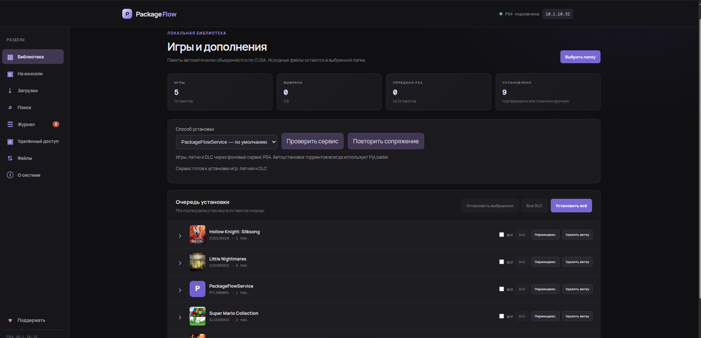

# PackageFlow — PS4 PKG Installer

**PackageFlow** (`playstation_installer`) — локальное веб‑приложение для установки `.pkg` / `.fpkg` пакетов на PlayStation 4 по сети прямо с компьютера. Без USB‑флешек, без копирования многогигабайтных файлов: PKG остаются в вашей папке, а консоль скачивает их с ПК по HTTP.

Встроенная интеграция с **qBittorrent** позволяет скачать пакет и автоматически отправить его на консоль после завершения загрузки.

> ⚠️ Проект рассчитан на PS4 с активным **GoldHEN** и загрузчиком payload на порту `9090`. PS5 в текущей версии не поддерживается.



---

## Содержание

- [Возможности](#возможности)
- [Как это работает](#как-это-работает)
- [Требования](#требования)
- [Установка](#установка)
- [Запуск](#запуск)
- [Использование](#использование)
- [Торрент‑клиент (qBittorrent)](#торрент-клиент-qbittorrent)
  - [qBittorrent на другом компьютере (NAS, сервер)](#qbittorrent-на-другом-компьютере-nas-сервер)
- [Поиск через Torznab (Jackett / Prowlarr)](#поиск-через-torznab-jackett--prowlarr)
- [Где хранятся данные](#где-хранятся-данные)
- [HTTP API](#http-api)
- [Структура проекта](#структура-проекта)
- [Решение проблем](#решение-проблем)
- [Ограничения](#ограничения)
- [Правовая оговорка](#правовая-оговорка)

---

## Возможности

**Библиотека пакетов**
- Рекурсивное сканирование папки с `.pkg` / `.fpkg` (до 500 пакетов за проход).
- Чтение метаданных прямо из PKG: `PARAM.SFO` (название, `TITLE_ID`, `CONTENT_ID`, `CATEGORY`) и обложка `icon0.png`.
- Автоматическое определение типа: **Игра**, **Патч**, **Бэкпорт** (по слову `backport` в имени), **DLC**.
- Группировка по `CUSA` — игра, её патчи и DLC отображаются одной «веткой».
- Кэш сканирования: повторный проход не перечитывает неизменённые файлы.
- Файлы **никогда не копируются** — приложение только читает их и раздаёт по HTTP.

**Установка на PS4**
- Установка одного пакета, выбранных, всех DLC или всей библиотеки.
- Правильный порядок очереди: **игра → патчи/бэкпорты → DLC**.
- Последовательная очередь: следующий пакет отправляется только после полной передачи предыдущего.
- Прогресс передачи в реальном времени (по HTTP Range‑запросам консоли).
- Очередь сохраняется на диск и продолжает работу после перезагрузки страницы или сервера.
- Если консоль не запросила файл за 20 секунд — результат отмечается как неподтверждённый; библиотека не получает ложную отметку установки.
- PyLoader остаётся способом по умолчанию, включая автоустановку торрентов. В той же библиотеке можно вручную выбрать PackegeFlowService для установки базовой игры, патча или DLC. Установка базовой игры Symphonia и её патча 1.01 через сервис 1.25 подтверждена на PS4; DLC пока проверены локальными тестами.
- Ручные отметки «Установлено» / «Снять».

**На консоли — сервис PKG 1.24**
- Отдельный раздел со списком фактически установленных игр и составом каждой: базовая игра, патч / бэкпорт, отдельные DLC, версии и размеры PKG, внутренний/внешний диск.
- Системное удаление выбранного патча, DLC, всех DLC или игры целиком с подтверждением TITLE_ID; сохранения не удаляются.
- Задания с результатом, частичным сбоем и восстановлением наблюдения без повторной команды. Сохранённое сопряжение используется автоматически.
- Названия и обложки читаются с консоли, при необходимости используются сведения из библиотеки на ПК. Добавлены запуск и остановка выбранной игры.
- Переустановка базовой игры через сервис: подтверждённое удаление прежней игры, патчей и DLC, затем установка выбранного PKG. Сохранения остаются.
- В «О системе» доступны проверка релиза GitHub, выбор локального PKG, установка и перезапуск сервиса. Первое обновление до 1.19 нужно поставить вручную. Опубликованный GitHub PKG 1.20 определяется и сверяется по содержимому пакета; PS4 скачивает обновление только с WEB в локальной сети.
- Запуск и остановка игры проверены через WEB на реальной PS4, в том числе при открытии WEB по обычному HTTP. Обновление до PKG 1.24 из локального файла установлено через WEB; API 0.6.5 вернулся после перезапуска. Обложки LittleBigPlanet 3, Trials Fusion и GTA V проверены в браузере. [Подробности проверки управления](docs/console-control-1.20.md).

**Торренты**
- Подключение к qBittorrent через Web UI API — на этом ПК, на NAS, в Docker или на другом компьютере в сети.
- Добавление magnet‑ссылок и HTTP(S)‑ссылок на `.torrent`.
- Пауза / продолжение / удаление задачи (файлы на диске сохраняются).
- Выбор отдельных файлов внутри торрента.
- **Автоустановка**: после завершения загрузки пакеты сами попадают в библиотеку и отправляются на PS4.
- Поиск по Torznab‑источнику (Jackett, Prowlarr и совместимые).

---

## Как это работает

```
┌──────────────────────────── ПК ─────────────────────────────┐        ┌──────── PS4 ────────┐
│                                                             │        │                     │
│  Браузер ──► PackageFlow (Nuxt/Nitro, порт 3000)            │        │  GoldHEN            │
│                 │                                           │        │  + загрузчик :9090  │
│                 │ 1. GET http://PS4:9090/status ────────────┼───────►│                     │
│                 │ 2. TCP  PS4:9090 ◄── payload (.bin) ──────┼───────►│  payload запущен    │
│                 │ 3. TCP  ПК:<случ. порт> ◄── подключение ──┼────────┤                     │
│                 │ 4. команда «установить»: URL, title,      │        │                     │
│                 │    CONTENT_ID, тип, размер, иконка ───────┼───────►│  BGFT               │
│                 │                                           │        │                     │
│   /json/<id>.json (манифест) ◄──────────────────────────────┼────────┤  скачивание PKG     │
│   /api/packages/<id> (Range) ◄──────────────────────────────┼────────┤  по HTTP            │
│                 │                                           │        │                     │
│  qBittorrent Web UI (этот ПК или NAS) ◄── API               │        └─────────────────────┘
└─────────────────────────────────────────────────────────────┘
```

1. Сервер проверяет готовность загрузчика: `GET http://<PS4_IP>:9090/status` должен вернуть `{"status":"ready"}`.
2. Определяет LAN‑IP компьютера, открывает TCP‑сервер на случайном порту и вшивает `IP:порт` в payload `public/ps4-pkg-installer.bin` (по маркеру `B4 B4 B4 B4 B4 B4`).
3. Отправляет payload на `PS4:9090`; payload подключается обратно к ПК.
4. Для каждого пакета сервер передаёт команду с URL манифеста `http://<PC_IP>:3000/json/<id>.json`.
5. Консоль через BGFT скачивает PKG с `/api/packages/<id>`, сервер считает переданные байты и двигает очередь.

---

## Требования

### Компьютер

| Компонент | Версия / примечание |
|---|---|
| ОС | Windows, Linux, macOS |
| Node.js | **20.19+** или **22 LTS** (требование Nuxt 4) |
| Пакетный менеджер | `pnpm` (рекомендуется) или `npm` |
| Диалог выбора папки | Windows и macOS — встроенный; Linux — `zenity` или `kdialog` (опционально) |
| qBittorrent | Опционально, 4.2+ (Web API v2 с тегами), включённый Web UI |
| Сеть | ПК и PS4 в одной локальной сети |

### PlayStation 4

- Прошивка с поддержкой эксплойта и загруженным **GoldHEN**.
- Загрузчик payload (PyLoader / BinLoader), который слушает TCP `9090` и отвечает на HTTP `GET /status` → `{"status":"ready"}`.
- Достаточно свободного места на внутреннем/расширенном накопителе.

---

## Установка

```bash
# 1. Клонировать репозиторий
git clone https://github.com/demagoc3-cpu/playstation_installer.git
cd playstation_installer

# 2. Установить зависимости
pnpm install          # или: npm install

# 3. (Linux, опционально) диалог выбора папки — на Windows и macOS не нужен
sudo apt install zenity          # Debian / Ubuntu
sudo dnf install zenity          # Fedora
sudo pacman -S zenity            # Arch
```

> Если `pnpm install` ругается на `pnpm-workspace.yaml`, замените строку
> `esbuild: set this to true or false` на `esbuild: true`.

### Открыть порты в файрволе

Консоль сама подключается к ПК, поэтому входящие соединения из LAN должны быть разрешены:

- **TCP 3000** — веб‑интерфейс, манифесты и раздача PKG;
- **TCP, случайный высокий порт** — обратное подключение payload (порт выбирается ОС при каждом запуске).

Пример для `ufw` (разрешить всё из домашней подсети):

```bash
sudo ufw allow from 192.168.1.0/24
```

Для `firewalld`:

```bash
sudo firewall-cmd --permanent --zone=trusted --add-source=192.168.1.0/24
sudo firewall-cmd --reload
```

---

## Запуск

### Режим разработки

```bash
pnpm dev
```

Сервер слушает `0.0.0.0:3000` (см. `nuxt.config.ts`). Откройте `http://localhost:3000`.

### Продакшен‑сборка

```bash
pnpm build
HOST=0.0.0.0 PORT=3000 node .output/server/index.mjs
```

> Запускайте сервер **из корня проекта**: пути к payload (`public/` или `.output/public/`) и к папке данных `.data/` вычисляются от текущего каталога.

### Автозапуск через systemd (Linux)

`/etc/systemd/system/packageflow.service`:

```ini
[Unit]
Description=PackageFlow PS4 installer
After=network-online.target

[Service]
Type=simple
User=developer
WorkingDirectory=/home/developer/projects/web/playstation_installer
Environment=HOST=0.0.0.0
Environment=PORT=3000
ExecStart=/usr/bin/node .output/server/index.mjs
Restart=on-failure

[Install]
WantedBy=multi-user.target
```

```bash
sudo systemctl daemon-reload
sudo systemctl enable --now packageflow
```

---

## Использование

### 1. Подготовить консоль

1. Запустите эксплойт и **GoldHEN** на PS4.
2. Убедитесь, что загрузчик payload активен на порту `9090`.
3. Узнайте IP консоли: **Настройки → Сеть → Просмотреть состояние соединения**.

### 2. Подключить PS4

1. Откройте PackageFlow в браузере.
2. Нажмите на IP‑адрес в правом верхнем углу (по умолчанию `10.1.200.5`), введите IP консоли → **Подключить**.
3. Индикатор станет зелёным: «PS4 подключена».

### 3. Добавить пакеты

- **«Выбрать папку»** — системный диалог выбора папки (Windows, macOS; в Linux — `zenity` или `kdialog`). Открывается на компьютере, где запущен сервер, и начинает с папки последнего сканирования.
- **«Указать путь»** (внизу страницы) — ввести полный путь вручную, например `/mnt/games/ps4`.

Сканер рекурсивно найдёт все `.pkg` / `.fpkg`, прочитает метаданные и обложки. Пакеты сгруппируются по `CUSA`. Библиотека сохраняется и восстанавливается при следующем открытии.

### 4. Установить


| Кнопка | Что делает |
|---|---|
| **Установить** (в строке пакета) | Отправляет один пакет |
| **Установить выбранное** | Все отмеченные галочками |
| **Все DLC** / **DLC** в ветке | Только DLC — всей библиотеки или одной игры |
| **Установить всё** | Всю библиотеку по порядку |

Статусы пакета: `Готов к отправке` → `Передаём задание` → `Ожидаем скачивание` → `PS4 получила X из Y` → `Файл полностью передан` (или `Отмечен как установленный`).

> Статус «полностью передан» означает, что консоль скачала весь файл. Сам процесс установки (BGFT) отображается уже на экране PS4 — загрузчик не возвращает этот процент в браузер.

**Установка через PackegeFlowService — первый тест PKG 1.17**

1. Установите `PackegeFlowService/build/PackegeFlowService-1.17.pkg` поверх предыдущей версии и запустите его на PS4.
2. На экране появится код из шести символов, например `F7Y-YUH`. Код действует пять минут; запускатель затем закрывается штатным способом.
3. В библиотеке WEB выберите «PackegeFlowService», укажите IP PS4 и введите код. Дефис и заглавные буквы добавляются автоматически.
4. Подключение сохраняется на сервере WEB и на PS4. Для следующих установок и перезапусков ввод не нужен. При смене адреса PS4 повторите сопряжение для нового адреса.
5. Для первого испытания выберите небольшую **базовую игру, которой ещё нет на PS4**. Через сервис пока отключены перезапись, патчи и DLC; для них используется PyLoader.

Сервис сообщает native task ID, счётчики скачивания больше 4 ГиБ, этап установки и ошибки. Полное скачивание не равно установке: завершение требует дополнительных системных проверок. При потере ответа WEB наблюдает прежнее задание и не отправляет его повторно. Отмена ожидает ответа консоли. Код и очередь проверены локально; полный цикл новой установки ещё нужно подтвердить на PS4.

### 5. Управление библиотекой

- **Установлено / Снять** — ручная отметка установки.
- **×** — убрать пакет из списка (файл на диске не трогается).
- **Переиндекс.** — пересканировать ветку игры (после замены/добавления файлов).
- **Удалить ветку** — убрать игру со всеми патчами и DLC из библиотеки.

---

## Торрент‑клиент (qBittorrent)

PackageFlow управляет qBittorrent через Web UI API. qBittorrent может работать на этом же ПК, на NAS, в Docker или на другом компьютере в локальной сети — укажите его адрес. Главное условие: скачанные файлы должны быть **доступны с компьютера, где запущен PackageFlow** (локальный диск, сетевая папка, подключённый диск).

### Установка qBittorrent

**Linux (с графическим интерфейсом):**

```bash
sudo apt install qbittorrent          # Debian / Ubuntu
sudo dnf install qbittorrent          # Fedora
sudo pacman -S qbittorrent            # Arch
```

**Linux (сервер без GUI) — `qbittorrent-nox`:**

```bash
sudo apt install qbittorrent-nox
qbittorrent-nox          # первый запуск: принять условия, в консоли будет логин и временный пароль
```

Автозапуск через systemd (Debian/Ubuntu‑пакет содержит шаблон сервиса):

```bash
sudo systemctl enable --now qbittorrent-nox@$USER
```

**Windows / macOS:** установщик с официального сайта — <https://www.qbittorrent.org/download>.

**Docker** (`linuxserver/qbittorrent`):

```yaml
services:
  qbittorrent:
    image: lscr.io/linuxserver/qbittorrent:latest
    environment:
      - PUID=1000
      - PGID=1000
      - WEBUI_PORT=8080
    ports:
      - 127.0.0.1:8080:8080
      - 6881:6881
      - 6881:6881/udp
    volumes:
      - ./qbit-config:/config
      # ВАЖНО: путь внутри контейнера должен совпадать с путём на хосте
      - /home/developer/Downloads/ps4:/home/developer/Downloads/ps4
    restart: unless-stopped
```

> Если qBittorrent в Docker или на другом компьютере видит папку загрузок по другому пути (например, `/downloads`), укажите этот путь в поле **«Та же папка в qBittorrent»** — PackageFlow сам переведёт пути. Либо монтируйте папку в контейнер по одинаковому пути внутри и снаружи.

### Включение Web UI

В GUI‑версии: **Инструменты → Настройки → Веб‑интерфейс**:

1. ✅ **Веб‑интерфейс (удалённое управление)**.
2. IP‑адрес: `127.0.0.1` (или `*`), порт: `8080`.
3. Задайте **имя пользователя** и **пароль**.
4. Нажмите **OK**.

В `qbittorrent-nox` Web UI включён по умолчанию; зайдите на `http://127.0.0.1:8080` с временным паролем из лога и смените его в настройках.

### Подключение к PackageFlow

1. В боковом меню откройте раздел **«Загрузки»** и нажмите **Настроить**.
2. Заполните:

   | Поле | Пример | Пояснение |
   |---|---|---|
   | Адрес qBittorrent Web UI | `http://127.0.0.1:8080` или `http://192.168.1.10:8080` | этот ПК или любой компьютер в сети |
   | Логин / Пароль | `admin` / ваш пароль | пустой пароль при повторном сохранении = оставить прежний |
   | Папка загрузок на этом ПК | `D:\Torrents\PS4`, `/home/user/Downloads/ps4`, `Z:\downloads` | отсюда PackageFlow берёт PKG |
   | Та же папка в qBittorrent | `/downloads` | только если qBittorrent на другом компьютере или в Docker |

3. **Сохранить и проверить** — появится «qBittorrent подключён · vX.Y.Z».

> Новые задачи сохраняются в эту папку (если qBittorrent на другом компьютере — в «Ту же папку в qBittorrent»). Автоимпорт работает только для файлов **внутри** папки загрузок — это защита от сканирования произвольных каталогов.
>
> **Пример с NAS:** qBittorrent на NAS сохраняет в `/volume1/downloads`, а на Windows эта папка подключена как диск `Z:`. Укажите адрес `http://192.168.1.20:8080`, «Папка загрузок на этом ПК» — `Z:\`, «Та же папка в qBittorrent» — `/volume1/downloads`.

### qBittorrent на другом компьютере (NAS, сервер)

qBittorrent не обязан работать на том же ПК, что и PackageFlow. Важно понимать, **откуда PS4 берёт пакет**: приставка качает PKG не из qBittorrent, а **с сервера PackageFlow** по HTTP. qBittorrent через API сообщает только список задач и пути к файлам — само содержимое PackageFlow читает с диска. Поэтому папка загрузок qBittorrent должна быть **доступна с ПК, где запущен PackageFlow**, как сетевая папка (SMB / NFS).

```
┌──────── NAS / другой ПК ────────┐        ┌──────── ПК с PackageFlow ────────┐        ┌───── PS4 ─────┐
│                                 │        │                                  │        │               │
│  qBittorrent Web UI  :8080 ◄────┼─ API ──┤  1. статус торрентов, пути       │        │               │
│                                 │        │                                  │        │               │
│  /volume1/downloads/Игра/*.pkg ─┼─ SMB ─►│  2. Z:\Игра\*.pkg (сетевой диск) │        │               │
│                                 │        │  3. сканирование → библиотека    │        │               │
│                                 │        │  4. HTTP :3000  /api/packages/…  ├─ HTTP ►│  BGFT качает  │
│                                 │        │                                  │        │  и ставит PKG │
└─────────────────────────────────┘        └──────────────────────────────────┘        └───────────────┘
```

**Как это работает:**

1. qBittorrent на NAS докачивает торрент в свою папку, например `/volume1/downloads/Игра`.
2. PackageFlow получает от qBittorrent путь и **переводит его в путь на этом ПК**: `/volume1/downloads/Игра` → `Z:\Игра`. Для этого в настройках заполняется поле «Та же папка в qBittorrent».
3. PackageFlow сканирует найденные PKG и добавляет их в библиотеку (а при включённой «Автоустановке» — сразу ставит в очередь).
4. PS4 получает ссылку `http://<IP ПК>:3000/json/<id>.json` и скачивает пакет **с ПК**, который в это время на лету читает его с NAS. Ничего не копируется, место на диске ПК не расходуется.

**Настройка:**

1. Откройте папку загрузок NAS по сети (SMB-шара, например `\\NAS\downloads`).
2. Подключите её на ПК с PackageFlow:
   - **Windows:** «Этот компьютер» → «Подключить сетевой диск» → буква `Z:` → `\\NAS\downloads` → ✅ «Восстанавливать подключение при входе в систему».
   - **Linux:**
     ```bash
     sudo apt install cifs-utils
     sudo mkdir -p /mnt/nas-downloads
     sudo mount -t cifs //NAS/downloads /mnt/nas-downloads -o username=USER,uid=$(id -u),gid=$(id -g)
     ```
     Для автоподключения добавьте строку в `/etc/fstab`.
3. В PackageFlow → **«Загрузки»** → **«Настроить»**:

   | Поле | Значение |
   |---|---|
   | Адрес qBittorrent Web UI | `http://192.168.1.20:8080` (IP NAS) |
   | Логин / Пароль | учётные данные Web UI qBittorrent |
   | Папка загрузок на этом ПК | `Z:\` (Windows) или `/mnt/nas-downloads` (Linux) |
   | Та же папка в qBittorrent | `/volume1/downloads` — как её видит сам qBittorrent (в Docker — путь внутри контейнера, например `/downloads`) |

4. **Сохранить и проверить.** Новые торренты, добавленные из PackageFlow, qBittorrent будет сохранять в свою папку, а PackageFlow — находить их через сетевой диск.

**Что важно учитывать:**

- **ПК с PackageFlow должен быть включён** во время установки, а сетевой диск — подключён.
- **Данные проходят по сети дважды:** NAS → ПК → PS4. В проводной гигабитной сети это почти не заметно; если ПК подключён по Wi‑Fi, скорость установки может заметно снизиться.
- Если в журнале появляется `Загруженные файлы не найдены: …` — путь из qBittorrent не удалось сопоставить с диском на ПК: проверьте, что сетевой диск подключён и что «Та же папка в qBittorrent» указана точно так, как её показывает qBittorrent (путь сохранения в свойствах торрента).

> **Совет:** если на NAS или сервере с qBittorrent можно установить Node.js 20+, выгоднее запустить **PackageFlow прямо там** (`pnpm build && pnpm start`). Тогда PKG идут напрямую NAS → PS4 одним «прыжком», ПК не нужен, а веб‑интерфейс открывается с любого устройства по `http://<IP NAS>:3000`. Поле «Та же папка в qBittorrent» в этом случае оставьте пустым; папки добавляются через «Указать путь» (системного диалога выбора папки на сервере без рабочего стола нет).

### Скачивание и автоустановка


1. Вставьте magnet‑ссылку (`magnet:?xt=urn:btih:…`) или HTTP(S)‑ссылку на `.torrent`.
2. При необходимости отметьте **«Установить после загрузки»**.
3. Нажмите **Скачать**.

Что происходит дальше:

- задача создаётся в qBittorrent с тегом `packageflow` (и `packageflow-auto-install`, если включена автоустановка);
- список задач обновляется каждые 2 секунды, пока вкладка открыта;
- **Файлы** — выбрать, какие файлы торрента качать (например, только нужный патч);
- по завершении загрузки папка торрента сканируется, пакеты попадают в библиотеку;
- если включена автоустановка и PS4 подключена — пакеты сразу уходят в очередь установки.

Автоустановку можно включить/выключить у уже добавленной задачи галочкой **«Автоустановка»**.

Кнопка **×** удаляет задачу из qBittorrent, **не удаляя скачанные файлы**.

> PackageFlow показывает только задачи с тегом `packageflow`. Торренты, добавленные в qBittorrent вручную, в списке не появятся.

> Автоимпорт выполняется браузером во время опроса, поэтому вкладка PackageFlow должна быть открыта, пока торрент докачивается.

---

## Поиск через Torznab (Jackett / Prowlarr)

Блок **«Поиск torrent»** работает с любым Torznab‑совместимым API.

1. Установите [Jackett](https://github.com/Jackett/Jackett) или [Prowlarr](https://github.com/Prowlarr/Prowlarr) и добавьте в него трекеры, которыми вы имеете право пользоваться.
2. Скопируйте **Torznab URL** индексатора и **API‑ключ**:
   - Jackett: `http://127.0.0.1:9117/api/v2.0/indexers/<indexer>/results/torznab/`
   - Prowlarr: `http://127.0.0.1:9696/<id>/api`
3. В PackageFlow: **Источник** → название, URL, API‑ключ → **Сохранить**.
4. Введите запрос → **Найти** → **Скачать** у нужного результата (уйдёт в qBittorrent, с учётом галочки «Установить после загрузки»).

Показывается до 40 результатов с размером и количеством сидов.

---

## Где хранятся данные

Всё состояние — обычные JSON‑файлы, база данных не нужна.

| Путь | Содержимое |
|---|---|
| `.data/package-library.json` | Библиотека пакетов и статистика передачи |
| `.data/installation-queue.json` | Текущая очередь установки |
| `.data/qbittorrent.json` | Настройки qBittorrent (**пароль хранится открытым текстом**) |
| `.data/search-providers.json` | Настройки Torznab (включая API‑ключ) |
| `.data/torrent-library.json` | Какие торренты уже проиндексированы |
| `<папка с PKG>/.packageflow/index.json` | Кэш сканирования папки |
| `<папка с PKG>/.packageflow/covers/*.png` | Извлечённые обложки |

Папка `.data/` уже в `.gitignore`. Чтобы полностью сбросить состояние — остановите сервер и удалите `.data/`.

---

## HTTP API

<details>
<summary>Список эндпоинтов</summary>

**PS4**

| Метод | Путь | Описание |
|---|---|---|
| `POST` | `/api/ps4/status` | `{ ip }` → готовность загрузчика на `:9090` |
| `GET` | `/api/ps4/service-status?ip=` | Проверка `PackegeFlowService` через `GET /ping` на `:12801` |
| `GET` | `/api/ps4/system-info?ip=` | Сведения о системе, внутреннем диске и состоянии PackegeFlowService для раздела «О системе» |
| `POST` | `/api/ps4/launch` | `{ ip }` → отправить payload и дождаться подключения |
| `POST` | `/api/ps4/queue` | Отправить одну задачу установки напрямую |
| `GET` | `/api/ps4/installation` | Состояние очереди установки |
| `POST` | `/api/ps4/installation` | `{ ip, packageIds, packageUrls, transport? }` → очередь; без transport используется payload |
| `GET` | `/api/ps4/service-installer?ip=` | Готовность API установки и сохранённого подключения |
| `POST` | `/api/ps4/service-key` | `{ ip, code }` → сопряжение коротким кодом; внутренний ключ не возвращается браузеру |

**Пакеты**

| Метод | Путь | Описание |
|---|---|---|
| `GET` | `/api/packages?psIp=` | Библиотека с URL манифестов |
| `POST` | `/api/packages/scan` | `{ directory, psIp, titleId? }` → сканировать папку |
| `POST` | `/api/packages/select-directory` | `{ initial? }` → открыть системный диалог выбора папки |
| `GET` | `/api/packages/:id` | Раздача PKG (поддержка `Range`) |
| `GET` | `/api/packages/:id?asset=icon` | Обложка PNG |
| `GET` | `/api/packages/:id?asset=delivery` | Прогресс передачи на PS4 |
| `POST` | `/api/packages/:id/installed` | `{ installed }` → отметка установки |
| `DELETE` | `/api/packages/:id` | Убрать пакет из библиотеки |
| `DELETE` | `/api/packages/branch?titleId=CUSAxxxxx` | Убрать ветку игры |
| `GET` | `/json/:id.json` | Манифест для BGFT |
| `GET` | `/api/manifests/:id` | То же, альтернативный путь |

**Торренты и поиск**

| Метод | Путь | Описание |
|---|---|---|
| `GET` / `POST` | `/api/torrents/settings` | Статус / сохранение настроек qBittorrent |
| `GET` | `/api/torrents` | Задачи с тегом `packageflow` |
| `POST` | `/api/torrents/add` | `{ source, installAfterDownload }` |
| `POST` | `/api/torrents/:hash/pause` \| `resume` \| `delete` | Управление задачей |
| `POST` | `/api/torrents/:hash/auto-install` | `{ enabled }` |
| `GET` / `POST` | `/api/torrents/:hash/files` | Файлы / приоритет `{ ids, priority }` |
| `POST` | `/api/torrents/:hash/library` | Импорт завершённого торрента в библиотеку |
| `GET` / `POST` | `/api/search/settings` | Настройки Torznab |
| `GET` | `/api/search?q=` | Поиск |

</details>

---

## Структура проекта

```
playstation_installer/
├── docs/screenshots/            # Скриншоты для README
├── app/
│   ├── app.vue                   # Основной интерфейс и боковое меню
│   └── components/FtpBrowser.vue # Экран проверки сервиса и план файлового проводника
├── public/
│   └── ps4-pkg-installer.bin     # Payload установщика для PS4
├── server/
│   ├── api/
│   │   ├── packages/             # Библиотека, сканирование, раздача PKG
│   │   ├── ps4/                  # Статус консоли, payload, очередь
│   │   ├── torrents/             # qBittorrent
│   │   ├── search/               # Torznab
│   │   └── manifests/            # Манифест BGFT (альтернативный путь)
│   ├── routes/json/[id].json.ts  # Манифест BGFT
│   └── utils/
│       ├── package-library.ts    # Парсинг PKG / PARAM.SFO, кэш, учёт передачи
│       ├── ps4-installer.ts      # Payload, TCP‑сессия, протокол команд
│       ├── installation-queue.ts # Последовательная очередь установки
│       ├── qbittorrent.ts        # Клиент qBittorrent Web API
│       ├── torrent-library.ts    # Индекс импортированных торрентов
│       └── search-providers.ts   # Клиент Torznab
├── nuxt.config.ts
└── package.json
```

**Стек:** Nuxt 4, Vue 3, Nitro (Node.js), TypeScript. Внешних runtime‑зависимостей, кроме Nuxt, нет.

---

## Решение проблем

| Симптом | Причина и решение |
|---|---|
| «PS4 не подключена» / `PyLoader не ответил на порту 9090` | GoldHEN или загрузчик не запущен, неверный IP, консоль в режиме покоя. Проверьте `curl http://<PS4_IP>:9090/status` |
| `Payload не подключился к серверу за 12 секунд` | Файрвол ПК блокирует входящие соединения от PS4, либо ПК и консоль в разных подсетях / VLAN |
| Задание отправлено, но PS4 не скачивает | Порт `3000` закрыт для LAN или сервер запущен на `127.0.0.1`. Запускайте с `HOST=0.0.0.0` |
| Пакет сразу стал «уже установленный» | Консоль не запросила файл за 20 с — обычно он действительно уже установлен, либо BGFT выдал ошибку на экране PS4. Нажмите «Снять» и повторите |
| `Не найден payload установщика` | Сервер запущен не из корня проекта или удалён `public/ps4-pkg-installer.bin` |
| `Некорректный заголовок PKG` / пакет не появился | Файл повреждён, недокачан или не является PS4 PKG |
| «Выбрать папку» не работает | Linux: нет `zenity`/`kdialog` или сервер запущен без графической сессии (например, как служба). Диалог открывается на ПК с сервером, а не на телефоне. Используйте «Указать путь» |
| `qBittorrent отклонил подключение` | Web UI выключен, неверный порт/логин/пароль, IP заблокирован после неудачных попыток (подождите или перезапустите qBittorrent) |
| `Загруженные файлы не найдены: …` | qBittorrent сохраняет файлы по пути, которого нет на этом ПК. Подключите папку загрузок как сетевой диск и заполните «Та же папка в qBittorrent» |
| `Файлы torrent находятся вне настроенной папки загрузок` | Задача сохраняет файлы не в «Папку загрузок» из настроек. Для Docker — пути хоста и контейнера различаются |
| Торрент докачался, но не импортировался | Вкладка PackageFlow была закрыта — откройте её, импорт произойдёт при следующем опросе |

---

## Ограничения

- Поддерживается только **PS4** (`CONTENT_TYPE` вида `PS4GD`, `PS4GP`, `PS4AC`…). PS5 не поддерживается.
- Одна активная очередь установки и одна сессия payload одновременно.
- За один проход сканируется до 500 пакетов; `PARAM.SFO` ищется в первых 32 МБ файла.
- Процент установки на самой консоли не передаётся в интерфейс.
- Разделы «Удалённый доступ» и «FTP» пока показывают подготовку подключения. Файловый API демона и управление экраном ещё не реализованы; FTP-раздел проверяет только `/ping`.
- Отдельный раздел «О системе» поддерживает PackegeFlowService API `0.3.0` и новее: прошивка, место на внутреннем диске, версия и время работы сервиса. PKG `1.03` / API `0.3.1` добавляет получение доступа к системным разделам через GoldHEN SDK, имя GoldHEN, семейство PS4/Pro и отображение ошибок диска. Точный CUH и версия релиза HEN могут оставаться неизвестными. Прошивка 12.50 и связь с вебом проверены пользователем на 1.02; исправление чтения диска 1.03 требует проверки на PS4. Данные обновляются каждые 15 секунд, пока раздел открыт; состояние демона проверяется отдельно от PyLoader.
- Нет авторизации: не открывайте порт `3000` в интернет — используйте только в доверенной локальной сети.
- Пароль qBittorrent и API‑ключ Torznab хранятся в `.data/` в открытом виде.

---

## Правовая оговорка

PackageFlow — инструмент для установки **собственных резервных копий, homebrew‑приложений и легально полученного контента** на принадлежащую вам консоль. Автор не распространяет игры, не предоставляет ссылки на них и не поощряет пиратство.

- Программа предоставляется **«как есть»**, без каких-либо гарантий. Автор не несёт ответственности за любой ущерб, связанный с её использованием: потерю данных, повреждение установленных приложений, неработоспособность консоли и т. п. (подробнее — в [LICENSE](LICENSE)).
- **Пользователь сам отвечает** за то, какой контент он устанавливает, и за соблюдение законов своей страны, авторских прав и пользовательских соглашений.
- Модификация прошивки консоли может нарушать пользовательское соглашение Sony и лишить гарантии. Вы используете проект на свой риск.
- PlayStation, PS4 и PS5 — товарные знаки Sony Interactive Entertainment Inc. Проект не связан с Sony и не одобрен ею.

---

## Лицензия

Исходный код PackageFlow распространяется под лицензией **MIT** — см. [LICENSE](LICENSE).

В репозиторий входит сторонний payload `ps4-pkg-installer.bin` из проекта [DirectPackageInstaller](https://github.com/marcussacana/DirectPackageInstaller) (лицензия GPL-3.0). На него лицензия MIT не распространяется — подробности в [THIRD_PARTY_NOTICES.md](THIRD_PARTY_NOTICES.md).
