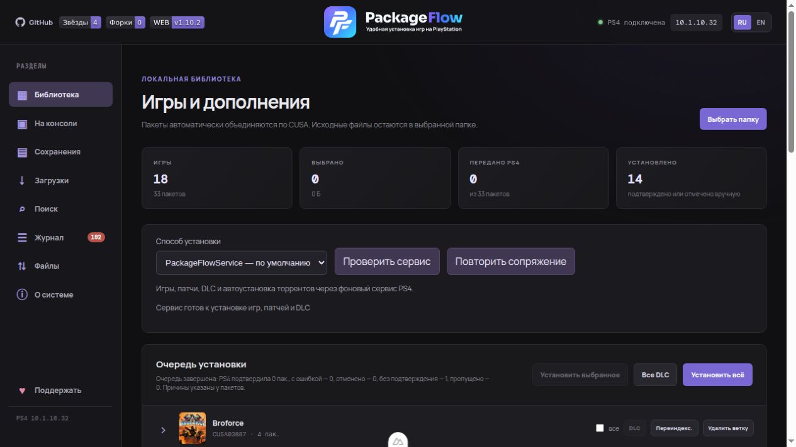
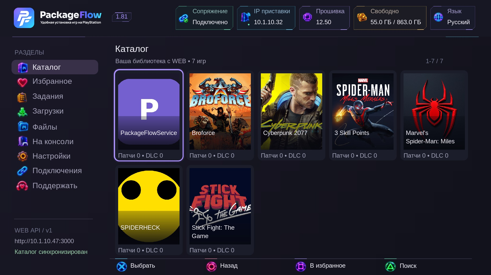
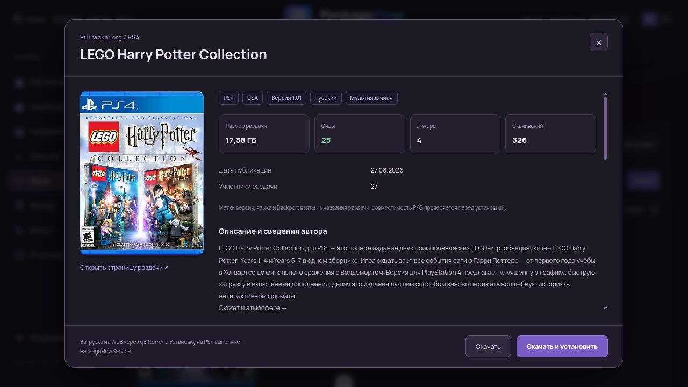

# PackageFlow

**Установка PKG на PlayStation 4 по сети и управление консолью.** WEB на ПК/NAS и приложение PackageFlowService на PS4 используют общую библиотеку и очередь. Пакеты передаются напрямую из вашей папки по HTTP, без USB и промежуточного копирования. Для Windows доступен **установщик EXE с мастером настройки и управления**.

[Релизы и PKG](https://github.com/demagoc3-cpu/playstation_installer/releases) · [Документация RU](docs/ru/index.md) · [Documentation EN](docs/en/index.md) · [Тема 4PDA](https://4pda.to/forum/index.php?showtopic=1127073)

## Возможности

- **Библиотека:** обложки, группировка игры, патчей и DLC, установка выбранного или всего комплекта, переустановка.
- **Общие задания WEB / PS4:** очередь, прогресс, результаты и отмена установок. Основной способ — PackageFlowService, резервный — PyLoader.
- **Приложение PS4:** Full HD, геймпад, штатная клавиатура, сопряжение и настройки фоновой службы.
- **Файлы и консоль:** файловый менеджер, локальные PKG, установленные приложения, сохранения и сведения о системе.
- **Поиск и загрузки:** Prowlarr/Jackett, карточки с описанием и обложкой, qBittorrent и автоустановка.
- **Мастер Windows:** запуск WEB, выбор папки PKG и её индексация, сопряжение с PS4, настройка RuTracker и qBittorrent. Статусы всех подключений, журнал действий, автозапуск и обновление установщика из GitHub.
- **RU / EN:** переключение языка с сохранением выбора.

## Быстрый запуск

Нужна **PS4 с активным GoldHEN** и компьютер в той же локальной сети. WEB работает на Windows, Linux и macOS.

### Windows — установщик

1. Скачайте **`PackageFlowSetup-…-x64.exe`** из [Releases](https://github.com/demagoc3-cpu/playstation_installer/releases) и установите на **Windows 10/11 x64**. WEB, Node.js и среда .NET уже входят в комплект. В конце установки можно добавить ярлык на рабочий стол.
2. В мастере выберите режим **Windows**, папку с PKG и IP компьютера. Нажмите **«Применить»** — мастер сохранит настройки, запустит WEB и проиндексирует папку.
3. Установите PKG PackageFlow на PS4 из того же раздела Releases. Откройте на консоли **«Подключения»**, получите код и введите его на шаге **«PS4»** в мастере.
4. При необходимости настройте поиск RuTracker и загрузки qBittorrent, затем откройте WEB и устанавливайте игры.

Мастер устанавливает Prowlarr и FlareSolverr, помогает подключить RuTracker по логину и паролю и показывает состояние WEB, сопряжения, qBittorrent, Prowlarr и FlareSolverr. Поиск и загрузки можно настроить позже; **qBittorrent устанавливается отдельно**.

Также доступен режим **Docker Compose** — для него нужны установленный и запущенный Docker Desktop. Подробности: [руководство Windows](docs/ru/windows.md).

### Linux, macOS и запуск из исходников

[Docker для Linux и NAS](docs/ru/docker.md) позволяет запускать готовый образ.

Для запуска из исходников установите **Node.js 22 LTS и pnpm**, затем:

```sh
git clone https://github.com/demagoc3-cpu/playstation_installer.git
cd playstation_installer
pnpm install
pnpm build
pnpm start
```

1. Откройте WEB: `http://localhost:3000`. Установите и запустите PKG PackageFlow на PS4 из [Releases](https://github.com/demagoc3-cpu/playstation_installer/releases).
2. Укажите IP приставки в WEB. В приложении PS4 откройте **«Подключения»** и введите полученный код в WEB. [Настройка адреса WEB и сопряжения](docs/ru/ps4-app.md).
3. Добавьте папку PKG в **«Библиотеку»** и запускайте установки из браузера или приложения PS4.

ПК/NAS должен оставаться включённым при установке из его библиотеки. Торренты скачивает qBittorrent на ПК/NAS, установкой управляет сервис. PS5 не поддерживается.

## Скриншоты

| Мастер Windows — установка и статусы | Мастер Windows — сопряжение с PS4 |
|---|---|
| [](docs/screenshots/windows-setup.png) | [](docs/screenshots/windows-pairing.png) |

| WEB — библиотека | Приложение PS4 — предпросмотр каталога |
|---|---|
| [](docs/screenshots/library-current.jpg) | [](docs/screenshots/ps4-catalog.jpg) |

<details>
<summary>Поиск — карточка раздачи с обложкой и описанием</summary>



</details>

## Документация

Подробные инструкции по всем разделам: **[Русский](docs/ru/index.md)** · **[English](docs/en/index.md)**.

[План развития](docs/ru/roadmap.md) · [API и разработка](docs/ru/development.md) · [Сообщить об ошибке](https://github.com/demagoc3-cpu/playstation_installer/issues)

## Лицензия

WEB — [MIT](LICENSE). PackageFlowService распространяется готовым PKG, его исходники приватные. Сторонний payload DirectPackageInstaller — GPL-3.0: [уведомления](THIRD_PARTY_NOTICES.md).

Проект предназначен для собственных резервных копий и homebrew, не распространяет игры и не связан с Sony.
