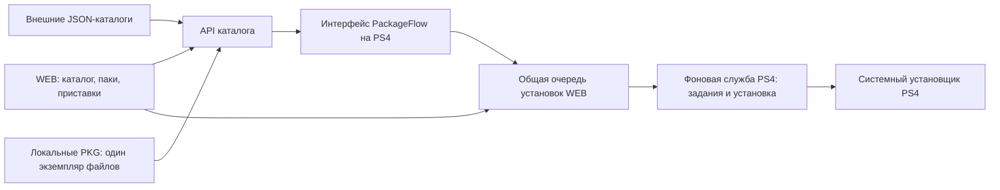

# PackageFlow: приложение PS4 и фоновая служба

Обновлено: 3 октября 2026. Рабочий план после проверки единого интерфейса на PS4.

## Продукт

Один устанавливаемый PKG, одна основная иконка PackageFlow. Внутри два
процесса: интерфейс и уже работающая фоновая служба. При открытии приложения
проверяется служба; закрытие интерфейса не завершает её задания. Служба работает
после активации HEN и запуска; запуск до HEN и работа после выключения PS4
этим планом не предусматриваются.

WEB и PS4 показывают одни данные и состояние одних заданий. Служба владеет
заданиями консоли, WEB управляет каталогом и несколькими приставками.
Обложки, описания и источники загрузки поступают через API, не включаются в PKG.

## Как выглядит приложение

Сохраняем проверенный тёмный интерфейс 1920×1080 (Full HD) с фиолетовым акцентом,
обложками, крупным фокусом и подсказками кнопок DualShock 4. Сеть, декодирование
обложек и запись настроек выполняются отдельно от обработки геймпада.

| Раздел | Содержимое |
| --- | --- |
| Каталог | Общая сетка, поиск, фильтры «Все / Локальные / Внешние», тип, язык, совместимость, установленное |
| Карточка игры | Название сверху; обложка слева, описание и пакеты справа; «Установить всё», «Установить выбранное», «Переустановить» |
| Избранное и паки | Сохранённые ссылки на выбранные игры и пакеты; редактирование и быстрая установка |
| Задания | Общая очередь установок WEB/PS4, текущий пакет, отмена одного пакета или всей очереди |
| Загрузки | Три источника: общие установки, торренты WEB, локальные торренты PS4; последняя вкладка пока не имеет загрузчика |
| На консоли | Установленные игры и компоненты, запуск и удаление через существующие операции службы |
| Подключения | Код сопряжения с оставшимся временем, доверенные клиенты, последний доступ, отзыв доступа |
| Настройки | RU/EN, адрес WEB, источники каталога, папка загрузок, кэш, версии, обновление и диагностика |
| Поддержать | Кошельки BTC и USDT из WEB; QR скрыты по умолчанию и показываются по одному |
| Файлы и сохранения | Позже: консольный интерфейс к уже проверенным операциям WEB/службы |

Сверху: версия приложения, IP приставки, прошивка, свободное место и язык. Реальную очередь показываем
также в свёрнутой карточке игры. Вопросы и ошибки не блокируют навигацию.

## Что полезно в других проектах

Проверены официальные README проектов, 3 октября 2026.

- [Itemzflow](https://github.com/LightningMods/Itemzflow): отдельный демон,
  установленный приложением, показ прогресса, сортировки, системный язык,
  резервный шрифт и настройка оформления. Берём принцип независимой службы
  и устойчивость интерфейса при отсутствии обложки.
- [FPKGi](https://github.com/ItsJokerZz/FPKGi): подключаемые JSON-каталоги,
  поиск/сортировка/фильтры, выбор папки и фоновые загрузки. Берём модель
  подключаемых источников. Описанный JSON использует прямые ссылки PKG;
  поддержка magnet в нашем приложении требует собственного загрузчика.
- [ezRemote Client](https://github.com/cy33hc/ps4-ezremote-client): источники
  FTP/SFTP/SMB/NFS/WebDAV/HTTP, предварительный просмотр PKG, файловые операции,
  фоновые передачи и возобновление. Для фонового режима README оговаривает
  отдельный сервер и ограничения; не переносим обещание работы в режиме покоя
  на нашу службу без испытания.

Наша цель: единый каталог, согласованная очередь WEB/PS4, проверка результата
установки, паки без копирования файлов, несколько приставок и понятный отзыв
доступа. Наличие/отсутствие такой комбинации у всех других приложений не проверено.

## Этапы и условия готовности

### 1. Единый PKG и сопряжение — начинаем сейчас

- Перенести плавный интерфейс из тестового приложения в основной запускатель.
- Сохранить идентификаторы PFLS00001/PFLS00002 и прежнее сопряжение WEB.
- Проверять и запускать службу существующим механизмом.
- Показывать действительный код, срок действия, использование и ошибку его получения.
- Дать обновить код без выхода из интерфейса.
- Сохранять язык и показывать реальную версию/IP службы.
- Сохранить закрытие запускателя при техническом перезапуске из WEB.

Готовность: сборка и проверки, затем PS4 — запуск, управление, сопряжение,
закрытие интерфейса, служба и WEB продолжают отвечать. До подключения реальных
команд очередь в интерфейсе остаётся явно обозначенной демонстрацией.

### 2. Общая очередь и настоящие команды интерфейса

За все системные установки отвечает PackageFlowService. Последовательность PKG
координирует существующая долговечная очередь WEB. И WEB, и интерфейс PS4 отправляют
в неё команды и показывают её состояния; отдельной очереди интерфейса нет.

Для библиотеки WEB PS4 получает поток PKG напрямую с ПК через системное задание.
Предварительное копирование файла в `/data` не требуется. WEB должен оставаться
доступным. Источник каталога и источник скачивания — разные понятия.

В «Загрузках» отдельно показываем:
- общие задания установки WEB / PS4;
- торренты WEB из подключённого к нему qBittorrent;
- локальные торренты PS4, только после реализации собственного загрузчика.

Карточка: заголовок сверху, обложка слева, описание справа; пакеты можно отмечать,
устанавливать все или выбранные. Переустановка использует существующие проверки
состава и отдельное подтверждение удаления. Команды имеют уникальный requestId;
при потере ответа читаем результат по нему, повторно установку не отправляем.
Язык хранится на PS4 и восстанавливается после закрытия/перезапуска интерфейса.

Проверки: свободное место, требования прошивки, нужная базовая игра/патч, выбранный
вариант бэкпорта. Повреждённый пакет отмечается ошибкой, очередь продолжается;
проблема связи допускает восстановление без дублирования установки.
100% передачи не означает успешную установку — сохраняем проверенное подтверждение
PS4, включая DLC. История переживает перезапуск, окончательный результат согласован
на WEB и PS4.

### 3. Доверенные устройства и настройки

Сейчас сопряжённые клиенты получают общий ключ. Для корректного отключения
одного устройства нужен отдельный токен каждому клиенту, реестр с именем,
временем последнего доступа и правами, миграция прежнего WEB без потери доступа.
Не показываем фиктивный список устройств по одному общему ключу.

Отзыв блокирует новые команды соответствующего клиента. Уже принятые задания
продолжаются, если пользователь отдельно не отменил их. Отзыв всех устройств —
отдельное подтверждаемое действие. Токены не показываются на экране и не попадают
в каталог, диагностический отчёт или журнал.

### 4. Внешняя JSON-библиотека — после основного интерфейса

WEB объединяет локальные файлы и внешние источники в один версионированный API.
Запись: sourceId, gameId/packageId, titleId, contentId, тип, версия, язык/регион,
описание RU/EN, размер, minFirmware, обложка, источник HTTP или magnet, digest
при наличии, зависимости и варианты установки. Отсутствующее поле — unknown/null,
не выдуманное значение. Магнитная ссылка описывает источник, а не команду запуска.

Не объединять разные файлы только по CUSA и версии: Fix/Rus и другие варианты
могут иметь одинаковые идентификаторы. Проверять метаданные самого PKG перед
установкой; заявленная совместимость каталога предварительная.

Добавить пагинацию: тестовый API ограничен 24 играми и 16 пакетами в группе и
может обрезать большую библиотеку. Ленивая загрузка обложек, ограниченный кэш,
сохранение последнего каталога, резервная обложка, HTTPS и проверка адресов
источников. Ошибка одного источника не убирает остальные.

### 5. Торрент непосредственно на PS4

Отдельный технический прототип загрузчика, затем включение в службу:
magnet/metadata, выбор PKG внутри торрента, проверка pieces, сохранение состояния,
ограничение скорости, пауза/возобновление, свободное место с учётом хранения PKG
и установки, очистка временных файлов. Испытание на собственном маленьком
пакете и крупном файле, включая разрыв сети и перезапуск PS4.

Пока не доказан подходящий движок на PS4, не обещаем прямую торрент-установку.
Загрузка через WEB и загрузка самой PS4 должны иметь разные понятные обозначения.
API каталога и меню могут развиваться до готовности торрент-движка.

### 6. Паки и несколько PS4

Пак сохраняет ссылки на конкретные пакеты и выбранный состав (игра/патч/DLC),
не копирует файлы. В WEB: «Сохранить выбранное как пак», имя, редактирование,
проверка доступности источников и выбор одной/нескольких PS4.
Отдельная страница приставок: имя, IP, включена/недоступна, прошивка, место,
сопряжение и текущая очередь. Каждая PS4 имеет независимые задания; общий
лимит сети учитывает параллельную установку. Отсутствующий пакет в паке явно
показан и не заменяется другим автоматически.

### 7. Последующее развитие

Файлы/сохранения в интерфейсе PS4, управляемое обновление единого PKG, диагностика,
затем исходящее подключение PS4 к серверу через Интернет с отзывом доступа и
переподключением. Удалённый экран остаётся отложенной задачей.

## Текущее состояние

- UI Preview 0.02: меню, геймпад, API каталога и плавность проверены на PS4.
- WEB: файловые операции, установка, подтверждение DLC, обработка ошибок работают;
  переключение RU/EN и API каталога подготовлены в рабочем дереве.
- Реальная очередь подключена к PS4 UI. Внешние JSON-источники, токены отдельных
  клиентов, паки и прямой торрент-движок пока не реализованы.
- Этап 1 реализован в едином PKG 1.58: установлен на PS4, служба отвечает WEB;
  пользователь подтвердил код, плавность и закрытие меню. Перезапуск из WEB
  отдельно проверен: новый процесс демона и автоматическое закрытие технического меню.
- Сохранение языка реализовано; на 1.60 пользователь подтвердил английский
  после закрытия и повторного открытия, а также плавность меню.

### Уточнение после 1.59

Общая очередь подключена к штатному механизму WEB; новые API не создают отдельного
установщика. Текущая библиотека содержит локальные PKG на ПК. Торрент-клиент WEB
показывается отдельно от системных установок. Вкладка локальных торрентов PS4
остаётся явно будущей функцией. Начиная с 1.63 интерфейс работает в Full HD;
пользователь подтвердил хорошую работу на PS4.

### Версия 1.65

Каталог: пять вытянутых карточек в ряд, два ряда, название поверх обложки и
счётчики патчей/DLC снизу. Карточка игры: короткие названия пакетов, прокрутка,
пять компактных кнопок с подписями по центру. Реальная очередь вынесена в
«Задания», торренты WEB и будущие локальные загрузки остаются в «Загрузках».
Добавлено «Поддержать» с кошельками из WEB и выбором одного QR.

Исправлена переустановка после заполнения 32 записей удаления: служба архивирует
завершённые результаты, сохраняя защиту от повторных команд. WEB возвращает
действительную ошибку переустановки вместо ложного принятия. 3 октября 2026
пользователь сообщил, что установил и проверил 1.65 на PS4.

### Исправление запуска 1.60

При техническом перезапуске 1.59 PS4 выключилась. После перезагрузки каталог и
реальные команды установки/переустановки из интерфейса работали; WEB получил
подтверждение системной установки. Причина выключения не установлена без
аварийного отчёта.

Найден и устранён конкретный риск: увеличенный объект игры занимал около 64 КБ
на стеке потока каталога. В 1.60 используется существующая запись в памяти,
рабочим потокам явно выделяется стек 1 МиБ, каталог и задания запрашиваются
после готовности службы, а технический запуск не загружает каталог. Сборка UI
отклоняет функции со стековым кадром более 16 КБ. Исправление проверено сборкой
PKG и тестами. На PS4 подтверждены установленный PARAM.SFO 01.60 и отпечаток
сборки, ответ новой службы 1.60, загрузка 7 игр каталога и общая очередь. После
запуска средняя отрисовка и копирование кадра составили около 5,7 мс; это не
замер частоты кадров и не проверка Full HD. Пользователь подтвердил плавность
и сохранение английского после повторного открытия. Реальная установка
небольшого DLC для SPIDERHECK на 1.60 подтверждена PS4; WEB и снимок общей
очереди для приложения совпадают. Повтор команды вернул прежний результат
без повторной установки.
