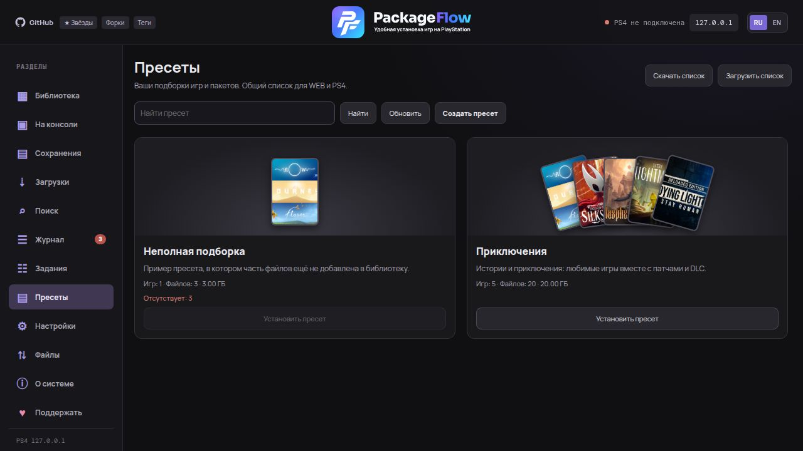
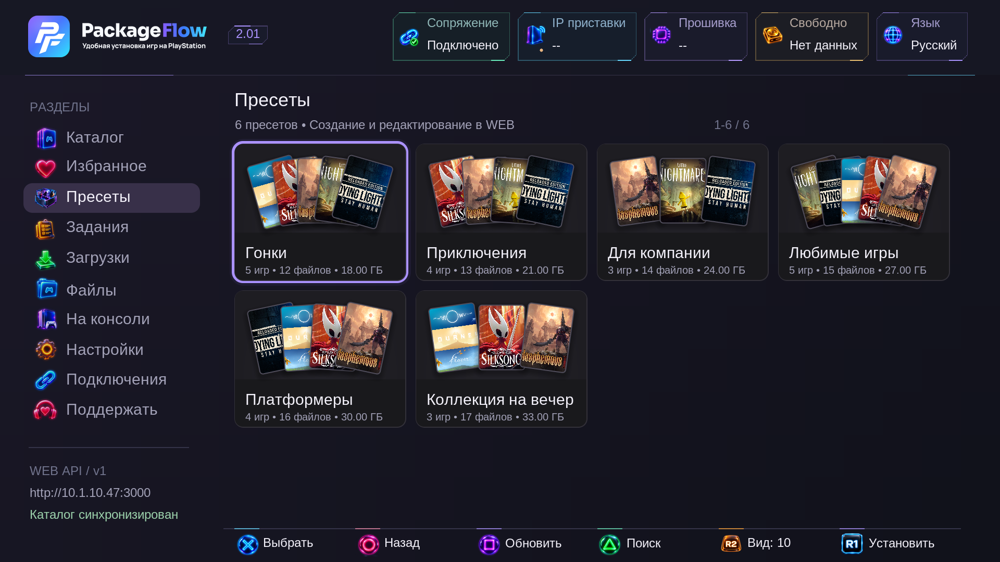

# Presets

Presets are your own collections of games, patches and DLC, such as Racing or Co-op. There is no fixed limit on the number of presets. Lists and game branches are paginated.

Select games or individual packages in the library and click **Add to preset**. Choose a collection or create one. The **Presets** section shows game count, file count and total size. Open a preset to rename it, remove selected packages, add more from the library or delete the collection; original PKGs remain unchanged.

**Install entire preset** and **Install selected** use the shared WEB/PS4 queue and its normal checks. Selection is kept across pages within the opened preset. Search covers the full preset and displays complete matching game branches.

## PS4

Update WEB and install **PackageFlowService 2.01**. Open **Presets** after pairing. Cross opens a collection and then a game card, where individual packages can be selected. Options inside a collection asks for confirmation before installing the entire preset. Circle returns to the preset list and Square refreshes it. **R1 Install** in the bottom bar installs the highlighted preset from the list or the entire opened collection, with confirmation. There is no upper install button. Presets use four cards per row, up to five fanned covers with rounded frames, and a single games/files/size line. **R2** cycles **10/20/30 cards and table view** in the catalog; the chosen view persists across restarts and updates. Lists load in pages.

## Export and import

**Download list** exports all presets; **Download preset** exports one. **Import list** adds collections from a PackageFlow JSON file without replacing existing presets. Exports contain package references and metadata, not PKG files, local paths, server URLs or credentials.

Packages on another computer are matched by PKG digest and Content ID; without a digest, by Content ID and file name. Missing packages remain visible and count toward file count and total size. Installing an incomplete preset in full is blocked; available files can be selected individually.

## Clear tasks

**Clear** hides completed, cancelled and failed tasks while preserving active and queued work. It does not delete files, PS4 system tasks or qBittorrent torrents. Future results remain visible.

## Layout and controls

**Create preset** opens a name and description dialog. Rectangular cards show up to five game covers, description, counts, size and installation. Library, presets and tasks share the same game tree, PKG metadata, notification fonts and status colours.

PS4 favorites persist across restarts and updates. **R1 Install** in the bottom bar queues games, patches and DLC from every page; the card badge matches the menu icon.

In PS4 Tasks, **L1** hides completed and failed entries while keeping active and waiting jobs. Category checkboxes filter the list; Cross selects an active or waiting task. **Options** offers cancellation of selected packages, their whole game branches, the current task or the entire queue. Selection persists across pages in the current queue; a branch includes its game, patches and DLC. **R1** switches history pages. Clearing does not delete PKGs or installed games.

