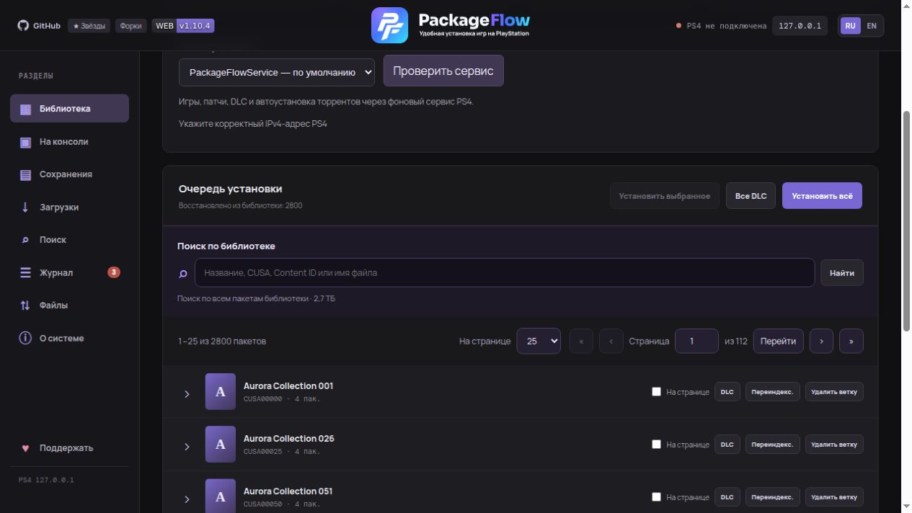

# Библиотека и установка

[← Содержание](index.md) · [English](../en/library.md)

## Использование

### 1. Подготовить консоль

1. Запустите эксплойт и **GoldHEN** на PS4.
2. Для PackageFlowService — запустите сервис (при первом использовании выполните [сопряжение](ps4-app.md#сопряжение)); для PyLoader — убедитесь, что загрузчик активен на порту `9090`.
3. Узнайте IP консоли: **Настройки → Сеть → Просмотреть состояние соединения**.

### 2. Подключить PS4

Нажмите на IP‑адрес в правом верхнем углу, введите IP консоли → **Подключить**. Индикатор станет зелёным. Адрес запоминается на сервере и восстанавливается при следующем открытии.

### 3. Добавить пакеты

- **«Выбрать папку»** — системный диалог выбора папки. Открывается на компьютере, где запущен сервер, и начинает с папки последнего сканирования.
- **«Указать путь»** (внизу страницы) — ввести путь вручную, например `D:\Games\PS4` или `/mnt/games/ps4`.

Сканер найдёт все `.pkg` / `.fpkg`, прочитает метаданные и обложки и сгруппирует пакеты по `CUSA`.

#### Страницы и поиск

WEB загружает с сервера только текущую страницу: **25 пакетов по умолчанию**, либо **50 или 100** на выбор. Размер страницы запоминается в браузере. Перейти к первой, последней или нужной странице можно над списком и под ним.

**«Поиск по библиотеке»** ищет по всем проиндексированным пакетам — по названию, CUSA, Content ID, имени файла, типу и версии. Сначала сервер находит совпадения во всей библиотеке, затем возвращает страницу результатов. Счётчики игр, пакетов и установок относятся ко всей библиотеке.

Игра, патчи и DLC продолжают группироваться по CUSA; большая ветка может занимать несколько страниц. Галочка **«На странице»** отмечает только видимые пакеты этой ветки. Выбор сохраняется при переходах и поиске; **«Снять выбор»** очищает его. **«Установить всё»** и **«Все DLC»** работают со всей библиотекой, а **DLC в ветке** — со всеми DLC игры, включая другие страницы.

### 4. Установить

Выберите **способ установки** — PackageFlowService (по умолчанию) или PyLoader — и нажмите:

Выбор сохраняется на сервере и применяется также к фоновой автоустановке торрентов и запросам установки без явно указанного способа. Уже запущенная очередь продолжает работу выбранным при её создании способом.

| Кнопка | Что делает |
|---|---|
| **Установить** (в строке пакета) | Отправляет один пакет |
| **Установить выбранное** | Все отмеченные галочками |
| **Все DLC** / **DLC** в ветке | Только DLC — всей библиотеки или одной игры |
| **Установить всё** | Всю библиотеку по порядку |
| **Отменить установку** | Останавливает очередь и текущую передачу |
| **Сбросить** | Возвращает пакет в «Готов к отправке», чтобы поставить его заново |

С PackageFlowService статус пакета доходит до подтверждённой установки. С PyLoader PackageFlow видит только передачу файла: «PS4 скачала пакет полностью», а итог установки показывается на экране приставки.

Перед отправкой каждого PKG через PackageFlowService WEB сверяет прошивку приставки с `SYSTEM_VER` и `PUBTOOLINFO.sdk_ver` внутри PKG. Пакет с требованием выше прошивки или без читаемых требований для игры/патча помечается «Пропущен»; следующие пакеты очереди обрабатываются дальше. Если сведения о PS4 временно недоступны, очередь ждёт их восстановления. DLC обычно не содержит собственного требования к прошивке, поэтому его окончательную совместимость с базовой игрой проверяет PS4. У бэкпорта могут различаться версии системы и SDK: если `SYSTEM_VER` всё ещё выше прошивки, автоматическая установка пропускает его (для запуска может требоваться спуф). Проверка отсекает известную несовместимость, но не обещает, что игра успешно запустится: это подтверждается самой консолью. Резервный способ PyLoader остаётся доступен без этой проверки.

> Если после отмены загрузка осталась в «Уведомления → Загрузки» на PS4, удалите её там: BGFT не создаёт новое задание для игры, пока висит старое.

### 5. Управление библиотекой

- **Установлено** — отметить пакет как уже установленный.
- **×** — убрать пакет из списка (файл на диске не трогается).
- **Переиндекс.** — пересканировать ветку игры после замены или добавления файлов.
- **Удалить ветку** — убрать игру со всеми патчами и DLC из библиотеки.

## Обычные приложения PS4

С PackageFlowService 1.69 библиотека поддерживает мини-приложения типа `PS4GDE`, например GameBaTo. Они устанавливаются как отдельное приложение через ту же очередь; базовая игра не нужна. Уже установленное приложение не перезаписывается без отдельной переустановки. Если в `SYSTEM_VER` явно записан ноль, WEB учитывает его как `0.00`; отсутствующие или нечитаемые требования по-прежнему остаются неизвестными, а более высокий SDK блокирует установку.
