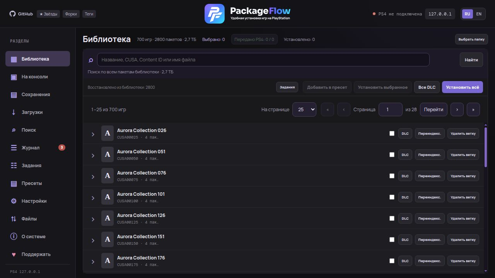
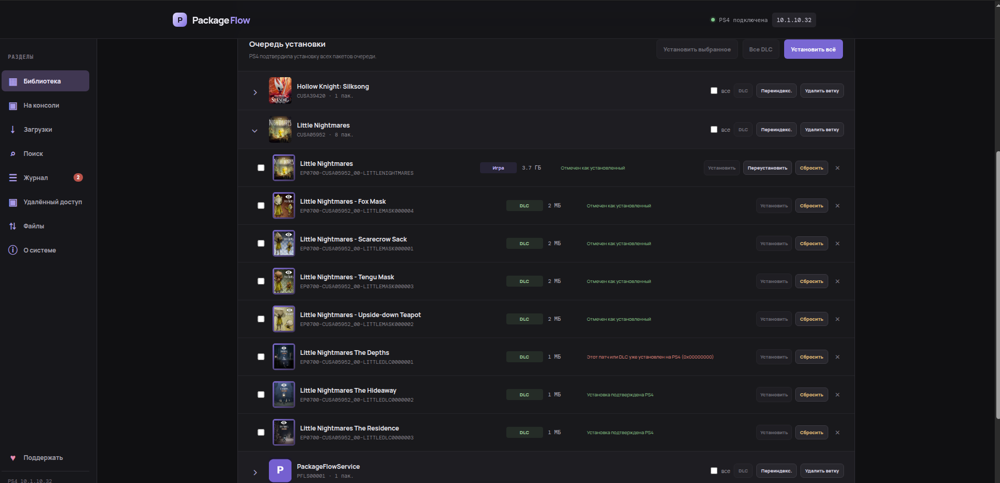

# Библиотека и установка

[← Содержание](index.md) · [English](../en/library.md)

## Использование

### 1. Подготовить консоль

1. Запустите эксплойт и **GoldHEN** на PS4.
2. Для PackageFlowService — запустите сервис (при первом использовании выполните [сопряжение](ps4-app.md#сопряжение)); для PyLoader — убедитесь, что загрузчик активен на порту `9090`.
3. Узнайте IP консоли: **Настройки → Сеть → Просмотреть состояние соединения**.

### 2. Подключить PS4

Откройте **«Настройки»** в боковом меню (или нажмите IP в шапке), укажите IP консоли и нажмите **«Сохранить и проверить»**. Здесь же находятся способ установки и сопряжение PackageFlowService. Адрес и способ установки запоминаются на сервере.

### 3. Добавить пакеты

- **«Выбрать папку»** — системный диалог выбора папки. Открывается на компьютере, где запущен сервер, и начинает с папки последнего сканирования.
- **«Настройки → Сканировать путь на ПК»** — ввести путь вручную, например `D:\Games\PS4` или `/mnt/games/ps4`.

Сканер найдёт все `.pkg` / `.fpkg`, прочитает метаданные и обложки и сгруппирует пакеты по `CUSA`.

#### Страницы и поиск

WEB загружает с сервера только текущую страницу: **25 карточек игр по умолчанию**, либо **50 или 100** на выбор. Число относится к карточкам игр; игра, её патчи и DLC находятся в одной ветке. Размер страницы запоминается в браузере. Перейти к первой, последней или нужной странице можно над списком. Прокручивается только список внутри карточки библиотеки: поиск, кнопки установки и переключатель страниц остаются на месте. Настройки подключения вынесены в отдельный раздел; компактная панель и строки пакетов оставляют больше места списку.

**«Поиск по библиотеке»** ищет по всем проиндексированным пакетам — по названию, CUSA, Content ID, имени файла, типу и версии. Если совпал хотя бы один пакет игры, сервер возвращает **всю ветку CUSA**: базовую игру, обновления, бэкпорты и DLC, даже если их названия отличаются. Затем результат делится на страницы. Счётчики игр, пакетов и установок относятся ко всей библиотеке.

Игра, патчи и DLC продолжают группироваться по CUSA; ветка игры не разделяется между страницами. Галочка в строке игры отмечает только видимые пакеты этой ветки. Выбор сохраняется при переходах и поиске; **«Снять выбор»** очищает его. **«Установить всё»** и **«Все DLC»** работают со всей библиотекой, а **DLC в ветке** — со всеми DLC игры, включая другие страницы.

### 4. Установить

В **«Настройках»** выберите **способ установки** — PackageFlowService (по умолчанию) или PyLoader — и нажмите:

Выбор сохраняется на сервере и применяется также к фоновой автоустановке торрентов и запросам установки без явно указанного способа. Уже запущенная очередь продолжает работу выбранным при её создании способом.

| Кнопка | Что делает |
|---|---|
| **Установить** (в строке пакета) | Отправляет один пакет |
| **Установить выбранное** | Все отмеченные галочками |
| **Все DLC** / **DLC** в ветке | Только DLC — всей библиотеки или одной игры |
| **Установить всё** | Всю библиотеку по порядку |
| **Отменить установку** | Останавливает очередь и текущую передачу |
| **Сбросить** | Возвращает пакет в «Готов к отправке», чтобы поставить его заново |

С PackageFlowService статус пакета доходит до подтверждённой установки. С PyLoader PackageFlow видит только передачу файла: «PS4 скачала пакет полностью», а итог установки показывается на экране приставки.

Перед отправкой каждого PKG через PackageFlowService WEB сверяет прошивку приставки с `SYSTEM_VER` и `PUBTOOLINFO.sdk_ver` внутри PKG. Пакет с требованием выше прошивки или без читаемых требований для игры/патча помечается «Пропущен»; следующие пакеты очереди обрабатываются дальше. Если сведения о PS4 временно недоступны, очередь ждёт их восстановления. DLC обычно не содержит собственного требования к прошивке, поэтому его окончательную совместимость с базовой игрой проверяет PS4. У бэкпорта могут различаться версии системы и SDK: если `SYSTEM_VER` всё ещё выше прошивки, автоматическая установка пропускает его (для запуска может требоваться спуф). Проверка отсекает известную несовместимость, но не обещает, что игра успешно запустится: это подтверждается самой консолью. Резервный способ PyLoader остаётся доступен без этой проверки.

> Если после отмены загрузка осталась в «Уведомления → Загрузки» на PS4, удалите её там: BGFT не создаёт новое задание для игры, пока висит старое.

### 5. Управление библиотекой

- **Установлено** — отметить пакет как уже установленный.
- **×** — убрать пакет из списка (файл на диске не трогается).
- **Переиндекс.** — пересканировать ветку игры после замены или добавления файлов.
- **Удалить ветку** — убрать игру со всеми патчами и DLC из библиотеки.

## Обычные приложения PS4

С PackageFlowService 1.69 библиотека поддерживает мини-приложения типа `PS4GDE`, например GameBaTo. Они устанавливаются как отдельное приложение через ту же очередь; базовая игра не нужна. Уже установленное приложение не перезаписывается без отдельной переустановки. Если в `SYSTEM_VER` явно записан ноль, WEB учитывает его как `0.00`; отсутствующие или нечитаемые требования по-прежнему остаются неизвестными, а более высокий SDK блокирует установку.

## Библиотека в сервисе PS4

Сервис **2.01** загружает страницы по **10/20/30 игр** с WEB; **R2** переключает 10/20/30 карточек и табличный вид. Выбранный вид сохраняется после перезапуска и обновления. При переходе вниз за последнюю строку
подгружается следующая порция, при движении вверх за первую — предыдущая.
Обложки и пакеты остальных игр не загружаются в память приставки. Счётчик и
полоса прокрутки показывают положение во всей библиотеке. Поиск на Треугольник
выполняется по всей библиотеке на WEB: название, CUSA, Content ID и имя файла.
Избранное сохраняется между запусками и обновлениями; кнопка установки всего списка включает пакеты со всех страниц. Обновите WEB и установите PackageFlowService **2.01**.

## Задания WEB

Раздел **«Задания»** показывает установки из общей очереди WEB/PS4 и загрузки qBittorrent. Текущая установка закреплена сверху и также отображается под логотипом в шапке. Фильтры **«Все», «Активные», «В очереди», «Завершённые», «С ошибками»** включают и скрывают категории; активные задания остаются закреплёнными.

- **Снимите галочку у ожидающего пакета** или нажмите **«Убрать из очереди»** — отменяется только этот пакет. Другие задания сохраняются.
- **«Отменить задание»** останавливает один текущий пакет. PackageFlowService подтверждает отмену через PS4; для PyLoader передача прерывается, а системную загрузку при необходимости удаляют на консоли.
- **«Отменить всю очередь»** останавливает все оставшиеся установки.
- Для qBittorrent доступны остановка, продолжение и удаление задания **без удаления скачанных файлов**.

**«Дерево»** группирует задания по игре: патчи, бэкпорты и DLC показаны дочерними строками. **«Таблица»** показывает компактный список со статусом, прогрессом и действиями. Выбранный вид запоминается. Уведомление о переустановке больше не занимает место в библиотеке; состояние отображается в заданиях и шапке.

История хранит десять предыдущих очередей установки; в таблице — 50 строк на странице, в дереве — 50 полных веток игр без разрыва между страницами. «Передано PS4» в библиотеке относится только к **выбранным пакетам**; кнопка раскрывает их конкретные имена файлов. Ручная отметка «Установлено» и отменённый пакет не считаются передачей.

## Единое отображение

Библиотека, пресеты и задания используют одно дерево игры, патчей и DLC. Значок типа пакета открывает сведения о PKG: Content ID, версии, требования к прошивке, SDK и другие доступные метаданные. Шрифты уведомлений и цвета статусов одинаковы во всех трёх разделах.

**Очистить** убирает завершённые записи и ошибки из заданий, сохраняя активные и ожидающие. На PS4 это **L1**, переключение страниц истории — **R1**. Подробнее: [пресеты и управление](presets.md).
