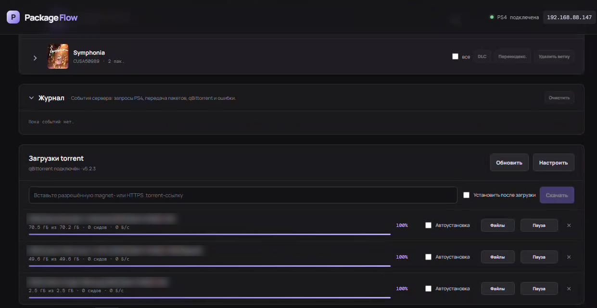

# Загрузки qBittorrent

[← Содержание](index.md) · [English](../en/torrents.md)

## Торрент-клиент (qBittorrent)

PackageFlow управляет qBittorrent через Web UI API. qBittorrent может работать на этом же ПК, на NAS, в Docker или на другом компьютере в локальной сети — укажите его адрес. Главное условие: скачанные файлы должны быть **доступны с компьютера, где запущен PackageFlow** (локальный диск, сетевая папка, подключённый диск).

### Установка qBittorrent

**Linux (с графическим интерфейсом):**

```bash
sudo apt install qbittorrent          # Debian / Ubuntu
sudo dnf install qbittorrent          # Fedora
sudo pacman -S qbittorrent            # Arch
```

**Linux (сервер без GUI) — `qbittorrent-nox`:**

```bash
sudo apt install qbittorrent-nox
qbittorrent-nox          # первый запуск: принять условия, в консоли будет логин и временный пароль
```

Автозапуск через systemd (Debian/Ubuntu‑пакет содержит шаблон сервиса):

```bash
sudo systemctl enable --now qbittorrent-nox@$USER
```

**Windows / macOS:** установщик с официального сайта — <https://www.qbittorrent.org/download>.

**Docker** (`linuxserver/qbittorrent`):

```yaml
services:
  qbittorrent:
    image: lscr.io/linuxserver/qbittorrent:latest
    environment:
      - PUID=1000
      - PGID=1000
      - WEBUI_PORT=8080
    ports:
      - 127.0.0.1:8080:8080
      - 6881:6881
      - 6881:6881/udp
    volumes:
      - ./qbit-config:/config
      # ВАЖНО: путь внутри контейнера должен совпадать с путём на хосте
      - /home/developer/Downloads/ps4:/home/developer/Downloads/ps4
    restart: unless-stopped
```

> Если qBittorrent в Docker или на другом компьютере видит папку загрузок по другому пути (например, `/downloads`), укажите этот путь в поле **«Та же папка в qBittorrent»** — PackageFlow сам переведёт пути. Либо монтируйте папку в контейнер по одинаковому пути внутри и снаружи.

### Включение Web UI

В GUI‑версии: **Инструменты → Настройки → Веб‑интерфейс**:

1. ✅ **Веб‑интерфейс (удалённое управление)**.
2. IP‑адрес: `127.0.0.1` (или `*`), порт: `8080`.
3. Задайте **имя пользователя** и **пароль**.
4. Нажмите **OK**.

В `qbittorrent-nox` Web UI включён по умолчанию; зайдите на `http://127.0.0.1:8080` с временным паролем из лога и смените его в настройках.

### Подключение к PackageFlow

1. В боковом меню откройте раздел **«Загрузки»** и нажмите **Настроить**.
2. Заполните:

   | Поле | Пример | Пояснение |
   |---|---|---|
   | Адрес qBittorrent Web UI | `http://127.0.0.1:8080` или `http://192.168.1.10:8080` | этот ПК или любой компьютер в сети |
   | Логин / Пароль | `admin` / ваш пароль | пустой пароль при повторном сохранении = оставить прежний |
   | Папка загрузок на этом ПК | `D:\Torrents\PS4`, `/home/user/Downloads/ps4`, `Z:\downloads` | отсюда PackageFlow берёт PKG |
   | Та же папка в qBittorrent | `/downloads` | только если qBittorrent на другом компьютере или в Docker |

3. **Сохранить и проверить** — появится «qBittorrent подключён · vX.Y.Z».

> Новые задачи сохраняются в эту папку (если qBittorrent на другом компьютере — в «Ту же папку в qBittorrent»). Автоимпорт работает только для файлов **внутри** папки загрузок — это защита от сканирования произвольных каталогов.
>
> **Пример с NAS:** qBittorrent на NAS сохраняет в `/volume1/downloads`, а на Windows эта папка подключена как диск `Z:`. Укажите адрес `http://192.168.1.20:8080`, «Папка загрузок на этом ПК» — `Z:\`, «Та же папка в qBittorrent» — `/volume1/downloads`.

### qBittorrent на другом компьютере (NAS, сервер)

qBittorrent не обязан работать на том же ПК, что и PackageFlow. Важно понимать, **откуда PS4 берёт пакет**: приставка качает PKG не из qBittorrent, а **с сервера PackageFlow** по HTTP. qBittorrent через API сообщает только список задач и пути к файлам — само содержимое PackageFlow читает с диска. Поэтому папка загрузок qBittorrent должна быть **доступна с ПК, где запущен PackageFlow**, как сетевая папка (SMB / NFS).

```
┌──────── NAS / другой ПК ────────┐        ┌──────── ПК с PackageFlow ────────┐        ┌───── PS4 ─────┐
│                                 │        │                                  │        │               │
│  qBittorrent Web UI  :8080 ◄────┼─ API ──┤  1. статус торрентов, пути       │        │               │
│                                 │        │                                  │        │               │
│  /volume1/downloads/Игра/*.pkg ─┼─ SMB ─►│  2. Z:\Игра\*.pkg (сетевой диск) │        │               │
│                                 │        │  3. сканирование → библиотека    │        │               │
│                                 │        │  4. HTTP :3000  /api/packages/…  ├─ HTTP ►│  BGFT качает  │
│                                 │        │                                  │        │  и ставит PKG │
└─────────────────────────────────┘        └──────────────────────────────────┘        └───────────────┘
```

**Как это работает:**

1. qBittorrent на NAS докачивает торрент в свою папку, например `/volume1/downloads/Игра`.
2. PackageFlow получает от qBittorrent путь и **переводит его в путь на этом ПК**: `/volume1/downloads/Игра` → `Z:\Игра`. Для этого в настройках заполняется поле «Та же папка в qBittorrent».
3. PackageFlow сканирует найденные PKG и добавляет их в библиотеку (а при включённой «Автоустановке» — сразу ставит в очередь).
4. PS4 получает ссылку `http://<IP ПК>:3000/json/<id>.json` и скачивает пакет **с ПК**, который в это время на лету читает его с NAS. Ничего не копируется, место на диске ПК не расходуется.

**Настройка:**

1. Откройте папку загрузок NAS по сети (SMB-шара, например `\\NAS\downloads`).
2. Подключите её на ПК с PackageFlow:
   - **Windows:** «Этот компьютер» → «Подключить сетевой диск» → буква `Z:` → `\\NAS\downloads` → ✅ «Восстанавливать подключение при входе в систему».
   - **Linux:**
     ```bash
     sudo apt install cifs-utils
     sudo mkdir -p /mnt/nas-downloads
     sudo mount -t cifs //NAS/downloads /mnt/nas-downloads -o username=USER,uid=$(id -u),gid=$(id -g)
     ```
     Для автоподключения добавьте строку в `/etc/fstab`.
3. В PackageFlow → **«Загрузки»** → **«Настроить»**:

   | Поле | Значение |
   |---|---|
   | Адрес qBittorrent Web UI | `http://192.168.1.20:8080` (IP NAS) |
   | Логин / Пароль | учётные данные Web UI qBittorrent |
   | Папка загрузок на этом ПК | `Z:\` (Windows) или `/mnt/nas-downloads` (Linux) |
   | Та же папка в qBittorrent | `/volume1/downloads` — как её видит сам qBittorrent (в Docker — путь внутри контейнера, например `/downloads`) |

4. **Сохранить и проверить.** Новые торренты, добавленные из PackageFlow, qBittorrent будет сохранять в свою папку, а PackageFlow — находить их через сетевой диск.

**Что важно учитывать:**

- **ПК с PackageFlow должен быть включён** во время установки, а сетевой диск — подключён.
- **Данные проходят по сети дважды:** NAS → ПК → PS4. В проводной гигабитной сети это почти не заметно; если ПК подключён по Wi‑Fi, скорость установки может заметно снизиться.
- Если в журнале появляется `Загруженные файлы не найдены: …` — путь из qBittorrent не удалось сопоставить с диском на ПК: проверьте, что сетевой диск подключён и что «Та же папка в qBittorrent» указана точно так, как её показывает qBittorrent (путь сохранения в свойствах торрента).

> **Совет:** если на NAS или сервере с qBittorrent можно установить Node.js 20+, выгоднее запустить **PackageFlow прямо там** (`pnpm build && pnpm start`). Тогда PKG идут напрямую NAS → PS4 одним «прыжком», ПК не нужен, а веб‑интерфейс открывается с любого устройства по `http://<IP NAS>:3000`. Поле «Та же папка в qBittorrent» в этом случае оставьте пустым; папки добавляются через «Указать путь» (системного диалога выбора папки на сервере без рабочего стола нет).

### Скачивание и автоустановка



1. Вставьте magnet‑ссылку (`magnet:?xt=urn:btih:…`) или HTTP(S)‑ссылку на `.torrent`.
2. При необходимости отметьте **«Установить после загрузки»**.
3. Нажмите **Скачать**.

Что происходит дальше:

- задача создаётся в qBittorrent с тегом `packageflow` (и `packageflow-auto-install`, если включена автоустановка);
- список задач на странице обновляется каждые 2 секунды;
- **Файлы** — выбрать, какие файлы торрента качать (например, только нужный патч);
- по завершении загрузки папка торрента сканируется, пакеты попадают в библиотеку;
- если включена автоустановка — **сервер сам** ставит пакеты в очередь установки (игра → патчи → DLC), даже когда страница PackageFlow закрыта. При выборе PackageFlowService он сверяет базовую игру и DLC с текущим составом PS4, а одноимённые варианты патча отправляет по версии и имени файла. Если PS4 выключена или идёт другая установка, он дождётся.

Автоустановку можно включить/выключить у уже добавленной задачи галочкой **«Автоустановка»**.

Кнопка **×** удаляет задачу из qBittorrent, **не удаляя скачанные файлы**.

> PackageFlow показывает только задачи с тегом `packageflow`. Торренты, добавленные в qBittorrent вручную, в списке не появятся.

> Автоустановка торрентов использует способ, выбранный в библиотеке. PackageFlowService выбран по умолчанию; PyLoader остаётся ручным выбором. Чтобы повторить попытку, снимите и снова поставьте галочку «Автоустановка». Нужен сохранённый IP приставки — хотя бы раз нажмите «Подключить».
