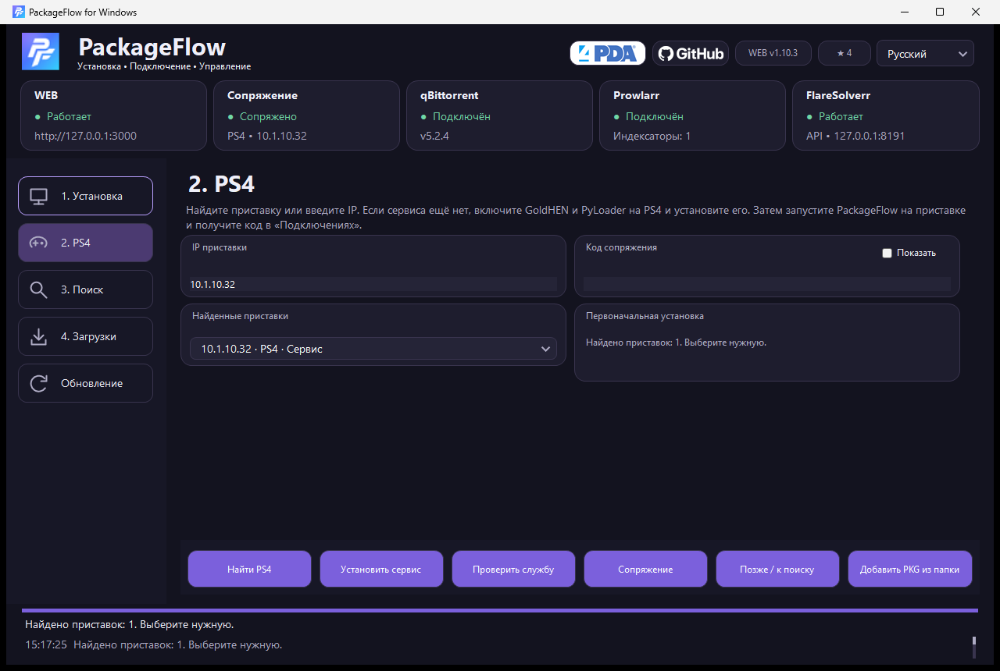
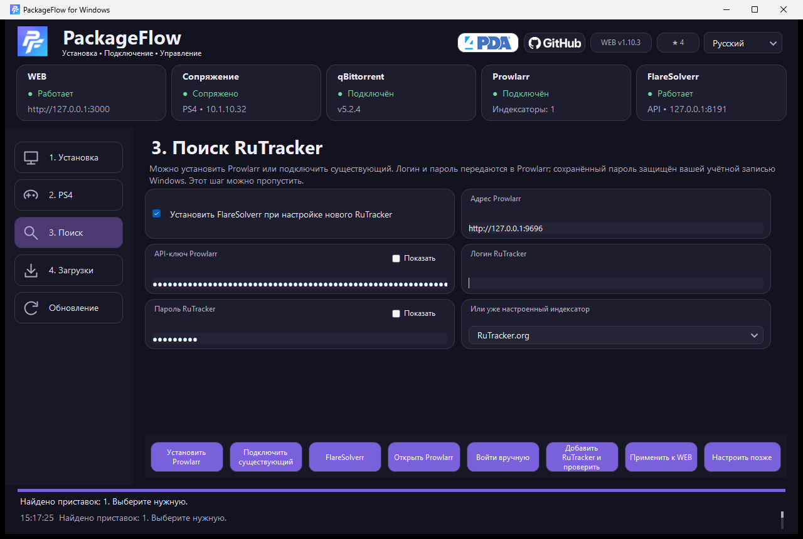

# PackageFlow для Windows — установка и настройка

## Статусы и ход настройки

В шапке каждой страницы видны отдельные карточки WEB, сопряжения с PS4, qBittorrent, Prowlarr и FlareSolverr. Они проверяют API при открытии мастера, после действий и каждые 15 секунд. «Не настроен», «Не проверен» и «Недоступен» — разные состояния: отсутствие запущенного WEB не означает, что qBittorrent отключён. Готовность API FlareSolverr не подтверждает прохождение проверки Cloudflare на трекере.

Внизу показываются текущий этап, проценты загрузки и последние события с временем. Распаковка компонентов выполняется отдельно от интерфейса. При автоматическом запуске видно, что именно запускается и когда WEB готов.

Windows использует видимый Chromium для совместимости с проверкой RuTracker. При загрузке описаний WEB сначала пробует HTTP; фоновый поиск не открывает браузер. Открытие карточки может запустить проверку через FlareSolverr. Закрытая браузерная сессия автоматически пересоздаётся один раз; обычный скрипт Cloudflare на готовой странице не считается ошибкой.

## Установка и запуск

При первом запуске в режиме Windows мастер автоматически запускает WEB, подготавливает Prowlarr и FlareSolverr, устанавливает qBittorrent при его отсутствии и подключает загрузки к WEB. По умолчанию используется папка `Downloads\PackageFlow` в профиле пользователя; её можно изменить кнопкой «Применить». При установке qBittorrent Windows запросит права администратора. Затем мастер открывает шаг поиска: введите логин и пароль RuTracker и нажмите «Добавить RuTracker и проверить».

Автонастройка сохраняет незавершённое состояние и продолжает подготовку при следующем запуске. Кнопка «Подготовить компоненты» позволяет повторить её вручную. Для нового подключения qBittorrent создаётся отдельный профиль и случайный пароль Web UI; API слушает только `127.0.0.1`. Уже сохранённое подключение проверяется без замены его настроек. Остановка WEB оставляет qBittorrent работать, чтобы не прерывать загрузки.

1. Запустите `PackageFlowSetup-…-x64.exe` на Windows 10/11 x64.
2. Выберите язык и установите приложение. Node.js и .NET уже входят в комплект.
3. В мастере выберите обычную установку Windows или Docker Compose.
4. Укажите папку с PKG и LAN IPv4 компьютера. По умолчанию WEB использует порт 3000, обратное подключение PS4 — 3001.
5. Нажмите «Применить».
6. Для доступа PS4 нажмите «Разрешить доступ PS4». Windows запросит права администратора для правил брандмауэра: частная сеть, локальная подсеть, выбранные TCP-порты.
7. На вкладке «PS4» найдите приставку в сети или введите IP. При необходимости установите сервис через PyLoader, затем запустите его на PS4 и введите код из «Подключений». Нажмите «Сопряжение». WEB передаёт PS4 LAN адрес этого компьютера и текущий порт; после смены компьютера адрес обновляется. Сопряжение можно выполнить позже.

Настройки и библиотека: `%LOCALAPPDATA%\PackageFlow\data`. Закрытие окна оставляет приложение в трее и не останавливает сервер. Для остановки используйте отдельную кнопку или пункт меню трея. Активные установки, передачи и непроверенные операции блокируют остановку и обновление.

## Поиск PS4 и первоначальная установка сервиса

1. Включите приставку и подключите её к той же локальной сети, что и компьютер. На шаге «Установка» выберите правильный IPv4 компьютера.
2. На шаге «PS4» нажмите **«Найти PS4»** и выберите приставку в списке. Мастер обнаруживает консоль и проверяет наличие сервиса/PyLoader. Приставку в режиме покоя нужно включить самостоятельно; IP можно ввести вручную.
3. Если PackageFlow ещё не установлен, активируйте **GoldHEN и PyLoader на порту 9090** на приставке, затем нажмите **«Установить сервис»**. Нужен запущенный WEB. Мастер скачает PKG из GitHub с проверкой SHA-256 и отправит через обычную очередь PyLoader без предварительного сопряжения.
4. Дождитесь установки в **«Уведомления → Загрузки»** на PS4. Сообщение «PKG передан» означает завершение передачи файла; итог установки проверяйте на приставке. Запустите PackageFlow, получите код в «Подключениях» и выполните сопряжение.

Если сервис уже запущен, мастер предложит перейти к сопряжению. При неподтверждённой передаче он показывает предупреждение и не отправляет установку повторно автоматически. Можно также установить PKG вручную из Releases.



## Поиск RuTracker

1. После автоматической подготовки откройте шаг «Поиск». При ручной настройке нажмите «Установить Prowlarr» либо «Подключить существующий».
2. Для существующего Prowlarr укажите его адрес и API-ключ из Settings → General.
3. Для нового RuTracker введите логин и пароль, затем «Добавить RuTracker и проверить».
4. Мастер тестирует индексатор в Prowlarr, сохраняет его и подключает Torznab с категорией PS4 к PackageFlow.
FlareSolverr включён по умолчанию на шаге поиска: мастер загружает официальный Windows x64 архив с проверкой SHA-256 либо запускает контейнер Compose. Затем создаёт проверяемый прокси в Prowlarr и привязывает его к RuTracker через отдельную метку; настройки остальных индексаторов сохраняются. Для существующей установки нажмите «FlareSolverr»: компонент будет подключён к уже настроенному RuTracker.

5. Если RuTracker уже настроен, выберите существующий индексатор и подключите его к WEB.

Логин и сохранённый пароль RuTracker отображаются в мастере. Пароль и API-ключи в настройках мастера защищены для текущего пользователя Windows (DPAPI). По умолчанию пароль скрыт; галочка «Показать» раскрывает введённое значение. Если Prowlarr вернул только маску пароля, мастер показывает подсказку «Сохранён в Prowlarr», а не выдаёт маску за настоящий пароль. Файлы конфигурации самого Prowlarr и WEB содержат необходимые для их работы ключи — не публикуйте папку данных.

Дополнительную аутентификацию, ограничения источника и прокси настраивайте через «Открыть Prowlarr». Неудача поиска не мешает работе библиотеки и PS4.

### Ошибка 500 при проверке FlareSolverr

Prowlarr проверяет прокси запросом к `https://prowlarr.servarr.com/v1/ping`. Если журнал FlareSolverr сообщает о блокировке Cloudflare на этом адресе, это не подтверждает блокировку RuTracker или неверный пароль. Ответ `200` от локальной главной страницы FlareSolverr подтверждает только запуск компонента.

Кнопка «Применить к WEB» проверяет уже настроенный индексатор без повторной установки прокси и изменения его меток. Для настройки FlareSolverr используется отдельная кнопка. Если стандартная проверка прокси возвращает ошибку, мастер отдельно проверяет через локальный FlareSolverr проверочный сайт и RuTracker. Только при подтверждённой блокировке Cloudflare на проверочном сайте и успешном ответе RuTracker применяется API Prowlarr `forceSave=true`. Об этом появляется сообщение. При других ошибках настройка останавливается; авторизация и поиск индексатора проверяются обычным способом перед подключением к WEB.

### RuTracker просит капчу при входе

Сообщение «Введите код подтверждения (символы, изображённые на картинке)» — капча самого RuTracker. Штатная форма индексатора Prowlarr не содержит поля для её ввода.

1. В обычном режиме Windows нажмите **«Войти вручную»** на шаге поиска. Для этого нужен локальный FlareSolverr и включённый видимый браузер.
2. В открывшемся Chromium войдите в RuTracker и, если потребуется, введите капчу или пройдите проверку Cloudflare. Мастер сохраняет отдельную сессию открытой до вашего подтверждения.
3. Вернитесь в мастер и нажмите **«Я вошёл — проверить»**. Мастер проверит вход, затем отдельно выполнит Test сохранённого индексатора Prowlarr и подключит его к WEB при успехе.
4. Если индексатор ещё не создан, после ручного входа введите данные в мастере и нажмите **«Добавить RuTracker и проверить»**.

Браузерные cookies не переносятся в Prowlarr: ручной вход может снять ограничение с капчей, но работоспособность индексатора подтверждается его собственным Test. Если проверка не проходит, мастер сообщает об ошибке. Ручной вход через мастер недоступен для Compose или удалённого FlareSolverr.



## qBittorrent

В режиме Windows автонастройка устанавливает и подключает qBittorrent. На вкладке «Загрузки» можно также подключить существующий клиент с Web UI и выбрать папку загрузок, как её видит клиент. Кнопка скачивания открывает официальный сайт для ручной установки.

## Docker Compose

Docker Desktop устанавливается отдельно. Мастер проверяет доступность Docker и Compose, создаёт конфигурацию и запускает контейнеры. Отдельный переключатель включает Prowlarr. Папка игр монтируется в `/games` только для чтения; данные WEB и Prowlarr сохраняются в папке пользователя. Prowlarr публикуется только на `127.0.0.1:9696`.

Для Compose используется готовая сборка WEB из установщика: Docker создаёт локальный образ с Node.js и этой сборкой. Исходники и npm не нужны; отдельно публиковать образ первого теста тоже не требуется. При первом запуске нужен доступ к реестрам контейнеров для загрузки базового Node.js и выбранных компонентов. Сборка упаковки проверяет отсутствие платформенных `.node`-модулей в WEB.

Существующий Prowlarr/qBittorrent на Windows должен быть доступен из контейнера через `host.docker.internal`. Если он слушает исключительно `127.0.0.1`, настройте доступный Docker адрес или используйте Prowlarr внутри Compose.

## Обновление и удаление

«Обновление» выбирает самую новую версию `PackageFlowSetup-<версия>-x64.exe` среди последних 100 GitHub Releases, исключая черновики и предварительные версии. Релизы только с PKG для PS4 не мешают поиску Windows-установщика. Перед запуском установщика проверяются размер и SHA-256, опубликованные GitHub. Отсутствие Windows-asset или его digest не вызывает запуск непроверенного файла. Саму службу PS4 по-прежнему можно обновлять из WEB или на приставке.

Установщик и удаление запрашивают безопасную остановку через приложение управления. Библиотека, настройки, сопряжение, установленные дополнительные компоненты и исходные игры сохраняются после удаления приложения.

## Сборка для разработчиков

Нужны Node.js 22, .NET SDK 8 и NSIS 3. На Windows из корня проекта:

```powershell
./packaging/windows/build.ps1 -Version 1.10.5 -DockerImage demagoc3/packageflow:latest
```

Также доступен GitHub Actions → Windows installer → Run workflow. Он выдаёт установщик и SHA256SUMS в артефактах; публикация релиза вручную. Исходники: `apps/windows-launcher`, упаковка: `packaging/windows`.

## Границы проверки

Интерфейс 1.10.5 и поиск PS4 проверены на реальной Windows; скриншоты сняты с работающего мастера. Первоначальная отправка PKG через PyLoader проверена автоматическими тестами с имитацией приставки. Установка на чистую PS4, первый запуск на новом компьютере и режим Compose требуют отдельной проверки.

## Изменения 0.1.6

Сопряжение с PS4 проверяется отдельно после WEB; недоступная приставка не отображается как сопряжённая только по сохранённому ключу. В шапке доступны ссылки на 4PDA и GitHub. Выпадающие списки исправлены, при смене языка введённые данные сохраняются. Настройки установки размещены в три колонки, действия — в одну строку. Папки игр и загрузок qBittorrent можно выбирать кнопками рядом с полем; для контейнера или другого компьютера путь можно вводить вручную. После установки предлагается создать ярлык на рабочем столе.

## Изменения 0.1.7

«Применить» сохраняет изменения и сразу индексирует выбранную папку. В режиме Windows смена папки и автозапуска применяется без остановки WEB. Режим, порты и адрес компьютера требуют безопасного перезапуска, который блокируется активными заданиями. При изменении адреса WEB мастер обновляет адрес на сопряжённой PS4; при недоступности приставки сообщает об этом и сохраняет необходимость повторной попытки. Изменения RuTracker тестируются перед сохранением, настройки прокси сохраняются. Открытый WEB обновляет библиотеку при возвращении в окно и каждые 10 секунд на странице библиотеки. Уменьшенное окно сохраняет полные подписи и границы карточек. В шапке логотипы 4PDA и GitHub одинаковой высоты; версия WEB и звёзды загружаются с GitHub, последние данные доступны при отсутствии сети.
